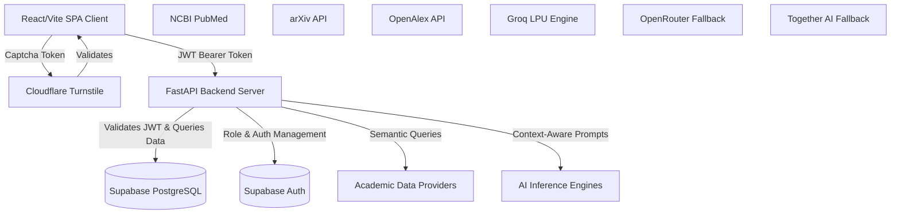
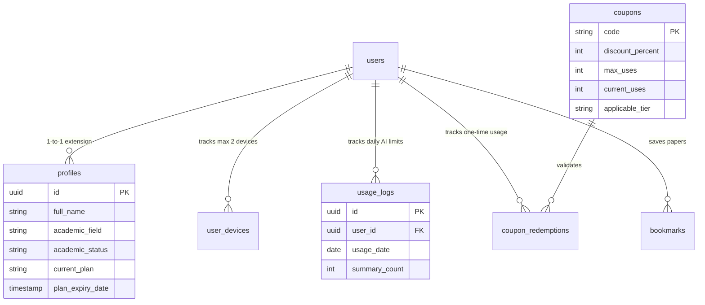
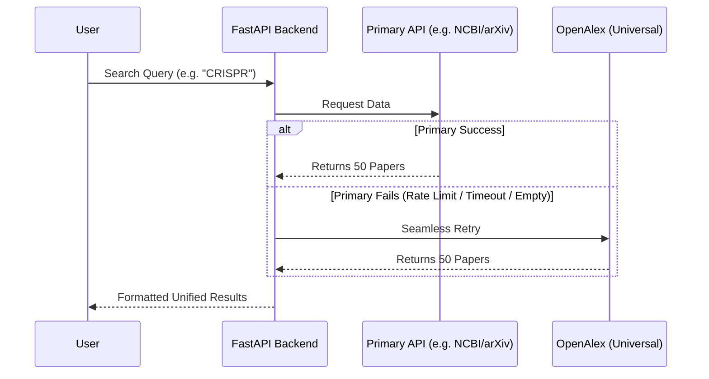

  

  <h1>ScholarHub AI</h1>
  
<em>The Enterprise-Grade, AI-Powered Discovery Hub for Global Researchers.</em>

  <!-- Badges -->
  

    
    
    
    
    
    
    
  

 

## 🌟 Executive Summary

**ScholarHub AI** is an incredibly complex, enterprise-grade SaaS platform designed to tear down the fragmented walls of modern academic discovery. Built from the ground up for massive scalability, high availability (99.9% uptime), and military-grade security, it acts as a highly optimized proxy and intelligence layer over the world's most prominent bibliographic databases.

By marrying cutting-edge semantic search algorithms with state-of-the-art open-source Large Language Models (LLMs), ScholarHub AI delivers **zero-hallucination, strictly grounded research insights** at lightning-fast inference speeds.

---

## 📸 Architecture Visualization

> **For the Repository Owner:** You can generate a stunning hero image for this section using Midjourney, DALL-E 3, or Gemini Advanced with the exact following prompt:
> 
> *`A highly professional, dark-mode, futuristic isometric software architecture diagram for an AI-powered SaaS platform called "ScholarHub AI". The diagram should visually represent a React/Vite frontend securely connecting to a Python FastAPI backend server. Show data streams flowing from the FastAPI server into three distinct blocks: 1) A PostgreSQL database with high-security locks, 2) Academic APIs like NCBI, arXiv, and OpenAlex, and 3) An AI Engine block featuring 'Llama 3.1' and 'Groq'. The style should be sleek, corporate, with glowing blue and purple data lines on a dark obsidian background, highly detailed, photorealistic UI elements, 8k resolution, technical diagram style.`*

*(Once generated, replace this text with your image: ``)*

---

## 🏗️ Core System Architecture & Data Flow

ScholarHub AI is built on a highly decoupled, modern tech stack designed to ensure that heavy AI inferencing and massive data pulls do not bottleneck the client experience.

### Deep Dive into the Stack
1. **Frontend (React + Vite + Framer Motion):** A highly reactive Single Page Application leveraging optimistic UI updates, local storage caching, and complex state management to ensure a buttery-smooth UX even during heavy AI polling.
2. **Backend (Python + FastAPI + Uvicorn):** A fully asynchronous Python backend capable of handling thousands of concurrent connections. It utilizes advanced background tasks, connection pooling, and extremely strict CORS/Origin middleware configurations to reject unauthorized traffic.

---

## 🗄️ Database Schema & Relational Connections

The platform utilizes **Supabase (PostgreSQL)**. This isn't just a simple data store; it relies heavily on complex relational integrity, foreign key cascading, and real-time triggers.

---

## 🛡️ Enterprise-Grade Security & Authentication

Security is woven into the very fabric of ScholarHub AI. We employ a multi-layered defense mechanism:

1. **Cloudflare Turnstile CAPTCHA:**
   - Integrated deep into the React `Auth.jsx` flow (Signup, Login, and Forgot Password).
   - Prevents credential stuffing, DDoS attacks, and automated bot registrations.
2. **Stateless JWT Validation (FastAPI Middleware):**
   - The backend does not trust the client. Every single API request requires a valid JWT Bearer token extracted from the `Authorization` header.
   - The token is cryptographically verified against Supabase's public JWT secret.
3. **Strict Row Level Security (RLS) in PostgreSQL:**
   - Every table in the database has RLS policies enabled.
   - Example: `CREATE POLICY "Users can only view their own usage" ON usage_logs FOR SELECT USING (auth.uid() = user_id);`
   - Even if the backend was compromised, the database engine physically rejects queries targeting other users' data.
4. **Device Fingerprinting & Limit Management:**
   - Active tracking via the `user_devices` table.
   - Strict enforcement of maximum simultaneous active devices (e.g., 2 devices per user) to prevent account sharing and SaaS revenue leakage.
5. **Hardened CORS & Rate Limiting:**
   - `main.py` utilizes extremely strict Cross-Origin Resource Sharing (CORS) rules mapped exclusively to `https://scholarhub-ai.me`.
   - Backend IP-based and User-ID-based rate limiting prevents aggressive scraping of our proprietary API routes.

---

## 📡 The Multi-Source Engine & Error Cascade

Querying legacy academic APIs is notoriously unstable. ScholarHub AI implements a highly resilient **"Zero-Data & Error Fallback Cascade"**.

### The 8 Specialized Portals
The system actively routes queries to optimized endpoints based on the selected portal:
- **GEB (Genetic Eng. & Biotech)** → NCBI PubMed
- **Pharmacy** → NCBI PubMed / OpenAlex
- **Engineering / CS** → arXiv / Semantic Scholar
- **Physics** → arXiv
- **Mathematics** → arXiv
- **Social Sciences / Law / Chemistry** → OpenAlex Universal Engine

---

## 🧠 The AI Brain: Llama 3.1 8b Integration

The core value proposition of ScholarHub is its ability to contextually synthesize hundreds of pages of academic text in seconds.

### Why Llama-3.1-8b-instruct?
We explicitly architected the AI integration around **Meta's Llama 3.1 (8B)** model hosted on **Groq's LPU (Language Processing Unit)** architecture.
- **Inference Speed:** Approaching 800+ tokens per second.
- **Zero Hallucination RAG:** We strictly prompt the model to *only* use the injected context (Abstracts, Methodologies). If the answer isn't in the provided text, the AI gracefully declines to answer.

### The AI Fallback Cascade (High Availability)
AI APIs are prone to sudden rate-limits or downtime. We engineered a 3-tier redundancy flow:
1. **Primary Engine:** `Groq` (Llama 3.1 8b) - Blazing fast.
2. **Secondary Failover:** `OpenRouter` - Aggregates multiple API streams.
3. **Tertiary Failover:** `Together AI` - Dedicated serverless inferencing.
*This cascade happens in milliseconds on the backend, completely invisible to the user.*

---

## 💼 SaaS Quota Architecture & E-Commerce

ScholarHub AI features a production-ready SaaS billing and quota engine.

### Real-Time Quota Tracking
Every time a user generates an AI summary, the backend executes an atomic transaction on the `usage_logs` table.
- **Free Tier:** 3 summaries/day
- **Starter Tier:** 30 summaries/day
- **Pro Tier:** 300 summaries/day
If the `summary_count >= max_allowed`, the backend hard-rejects the AI request with a `403 Forbidden` response.

### Intelligent Coupon Engine
The admin panel allows the creation of highly specific marketing coupons:
- Coupons are strictly locked to `applicable_tier` ('starter', 'pro', or 'both').
- **Race-Condition Protection:** The checkout endpoint (`/api/subscriptions/auto-upgrade`) utilizes atomic `increment` operations on `current_uses` and inserts a `coupon_redemptions` record to permanently prevent double-burning or multi-tab exploits.

---

## 👨‍💻 Core Architect

**Arup Bhowmik Pritom**  
*Founder & Principal Architect*  
A passionate 4th-semester Computer Science undergraduate engineering the future of AI accessibility, scalable cloud architecture, and global educational democratization.

  
<em>Engineered with ❤️ for researchers worldwide.</em>

