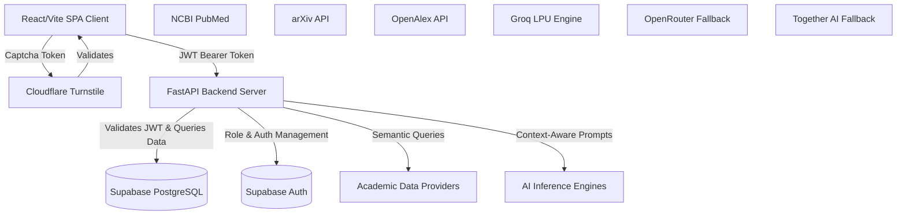
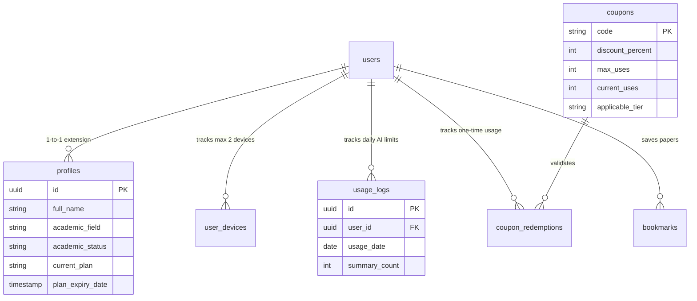
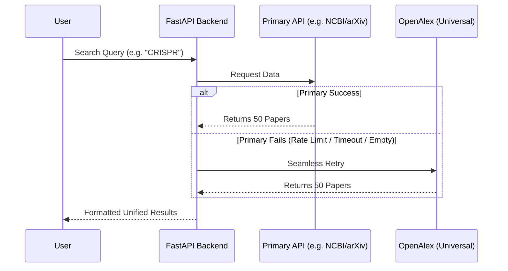

  

  <h1>ScholarHub AI</h1>
  
<em>The Enterprise-Grade, AI-Powered Discovery Hub for Global Researchers.</em>

  <!-- Badges -->
  

    
    
    
    
    
    
    
  

 

## Executive Summary

**ScholarHub AI** is an incredibly complex, enterprise-grade SaaS platform designed to tear down the fragmented walls of modern academic discovery. Built from the ground up for massive scalability, high availability (99.9% uptime), and military-grade security, it acts as a highly optimized proxy and intelligence layer over the world's most prominent bibliographic databases.

By marrying cutting-edge semantic search algorithms with state-of-the-art open-source Large Language Models (LLMs), ScholarHub AI delivers **zero-hallucination, strictly grounded research insights** at lightning-fast inference speeds.

---

## Architecture Visualization

---

## 💻 Desktop Experience

ScholarHub AI features a seamless, highly responsive web interface designed for deep research sessions, real-time analytics, and enterprise-grade data management.

<table align="center">
  <tr>
    <td align="center" width="50%">
      
       <b>Landing Page & Hero</b>
    </td>
    <td align="center" width="50%">
      
       <b>Live Data and Engine Informations</b>
    </td>
  </tr>
  <tr>
    <td align="center">
      
       <b>Transparent SaaS Pricing</b>
    </td>
    <td align="center">
      
       <b>Community Integration</b>
    </td>
  </tr>
  <tr>
    <td align="center">
      
       <b>Primary Search Dashboard</b>
    </td>
    <td align="center">
      
       <b>Advanced Date & Priority Filters</b>
    </td>
  </tr>
  <tr>
    <td align="center">
      
       <b>In-Depth Paper Details and Llama 3.1 AI Executive Report</b>
    </td>
    <td align="center">
      
       <b>Pricing</b>
    </td>
  </tr>
</table>

 

## 📱 Mobile-First Architecture

We built ScholarHub AI to be 100% responsive out of the box, delivering a native-app-like experience on all mobile devices with slide-out drawers, swipeable portals, and native bottom sheets.

<table align="center">
  <tr>
    <td align="center" width="25%">
      
       <b>Mobile Landing</b>
    </td>
    <td align="center" width="25%">
      
       <b>Mobile Dashboard</b>
    </td>
    <td align="center" width="25%">
      
       <b>Llama 3.1 AI Executive Report</b>
    </td>
    <td align="center" width="25%">
      
       <b>Profile and Security</b>
    </td>
  </tr>
</table>

 
## Core System Architecture & Data Flow

ScholarHub AI is built on a highly decoupled, modern tech stack designed to ensure that heavy AI inferencing and massive data pulls do not bottleneck the client experience.

### Deep Dive into the Stack
1. **Frontend (React + Vite + Framer Motion):** A highly reactive Single Page Application leveraging optimistic UI updates, local storage caching, and complex state management to ensure a buttery-smooth UX even during heavy AI polling.
2. **Backend (Python + FastAPI + Uvicorn):** A fully asynchronous Python backend capable of handling thousands of concurrent connections. It utilizes advanced background tasks, connection pooling, and extremely strict CORS/Origin middleware configurations to reject unauthorized traffic.

---

## Database Schema & Relational Connections

The platform utilizes **Supabase (PostgreSQL)**. This isn't just a simple data store; it relies heavily on complex relational integrity, foreign key cascading, and real-time triggers.

---

## Enterprise-Grade Security & Authentication

Security is woven into the very fabric of ScholarHub AI. We employ a multi-layered defense mechanism:

1. **Cloudflare Turnstile CAPTCHA:**
   - Integrated deep into the React `Auth.jsx` flow (Signup, Login, and Forgot Password).
   - Prevents credential stuffing, DDoS attacks, and automated bot registrations.
2. **Stateless JWT Validation (FastAPI Middleware):**
   - The backend does not trust the client. Every single API request requires a valid JWT Bearer token extracted from the `Authorization` header.
   - The token is cryptographically verified against Supabase's public JWT secret.
3. **Strict Row Level Security (RLS) in PostgreSQL:**
   - Every table in the database has RLS policies enabled.
   - Example: `CREATE POLICY "Users can only view their own usage" ON usage_logs FOR SELECT USING (auth.uid() = user_id);`
   - Even if the backend was compromised, the database engine physically rejects queries targeting other users' data.
4. **Device Fingerprinting & Limit Management:**
   - Active tracking via the `user_devices` table.
   - Strict enforcement of maximum simultaneous active devices (e.g., 2 devices per user) to prevent account sharing and SaaS revenue leakage.
5. **Hardened CORS & Rate Limiting:**
   - `main.py` utilizes extremely strict Cross-Origin Resource Sharing (CORS) rules mapped exclusively to `https://scholarhub-ai.me`.
   - Backend IP-based and User-ID-based rate limiting prevents aggressive scraping of our proprietary API routes.

---

## The Multi-Source Engine & Error Cascade

Querying legacy academic APIs is notoriously unstable. ScholarHub AI implements a highly resilient **"Zero-Data & Error Fallback Cascade"**.

### The 8 Specialized Portals
The system actively routes queries to optimized endpoints based on the selected portal:
- **GEB (Genetic Eng. & Biotech)** → NCBI PubMed
- **Pharmacy** → NCBI PubMed / OpenAlex
- **Engineering / CS** → arXiv / Semantic Scholar
- **Physics** → arXiv
- **Mathematics** → arXiv
- **Social Sciences / Law / Chemistry** → OpenAlex Universal Engine

---

## The AI Brain: Llama 3.1 8b Integration

The core value proposition of ScholarHub is its ability to contextually synthesize hundreds of pages of academic text in seconds.

### Why Llama-3.1-8b-instruct?
We explicitly architected the AI integration around **Meta's Llama 3.1 (8B)** model hosted on **Groq's LPU (Language Processing Unit)** architecture.
- **Inference Speed:** Approaching 800+ tokens per second.
- **Zero Hallucination RAG:** We strictly prompt the model to *only* use the injected context (Abstracts, Methodologies). If the answer isn't in the provided text, the AI gracefully declines to answer.

### The AI Fallback Cascade (High Availability)
AI APIs are prone to sudden rate-limits or downtime. We engineered a 3-tier redundancy flow:
1. **Primary Engine:** `Groq` (Llama 3.1 8b) - Blazing fast.
2. **Secondary Failover:** `OpenRouter` - Aggregates multiple API streams.
3. **Tertiary Failover:** `Together AI` - Dedicated serverless inferencing.
*This cascade happens in milliseconds on the backend, completely invisible to the user.*

---

## SaaS Quota Architecture & E-Commerce

ScholarHub AI features a production-ready SaaS billing and quota engine.

### Real-Time Quota Tracking
Every time a user generates an AI summary, the backend executes an atomic transaction on the `usage_logs` table.
- **Free Tier:** 3 summaries/day
- **Starter Tier:** 30 summaries/day
- **Pro Tier:** 300 summaries/day
If the `summary_count >= max_allowed`, the backend hard-rejects the AI request with a `403 Forbidden` response.

### Intelligent Coupon Engine
The admin panel allows the creation of highly specific marketing coupons:
- Coupons are strictly locked to `applicable_tier` ('starter', 'pro', or 'both').
- **Race-Condition Protection:** The checkout endpoint (`/api/subscriptions/auto-upgrade`) utilizes atomic `increment` operations on `current_uses` and inserts a `coupon_redemptions` record to permanently prevent double-burning or multi-tab exploits.

---

## Core Architect

**Arup Bhowmik Pritom**  
*Founder & Principal Architect*  
A passionate 4th-semester Computer Science undergraduate engineering the future of AI accessibility, scalable cloud architecture, and global educational democratization.

  
<em>Engineered with ❤️ for researchers worldwide.</em>

