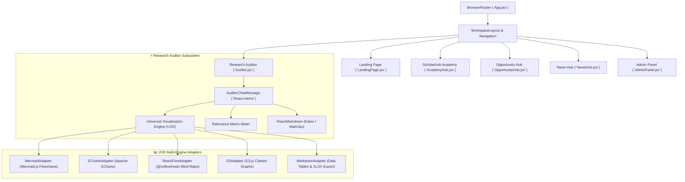

<div align="center">
  

  <h1>ScholarHub AI — Frontend Client</h1>
  <p><strong>Next-Generation Academic SPA Built with React 18, Vite 5 & TailwindCSS</strong></p>

  <!-- Badges -->
  <p>
    <a href="https://react.dev/"></a>
    <a href="https://vitejs.dev/"></a>
    <a href="https://tailwindcss.com/"></a>
    <a href="https://framer.com/motion"></a>
    <a href="https://reactflow.dev/"></a>
    <a href="https://echarts.apache.org/"></a>
  </p>

  <p>
    <a href="./SYSTEM_ARCHITECTURE_DEEP_DIVE.md">🏛️ Full System Architecture Deep Dive</a>
  </p>
</div>

---

## 🌟 Overview

The **ScholarHub AI Frontend** is a modern, high-performance Single Page Application (SPA) designed to deliver a desktop-class research experience. It handles real-time Server-Sent Events (SSE) streaming, interactive multi-engine scientific visualizations (Mermaid, ECharts, React Flow, D3), and complex academic workflows with zero UI latency.

---

## 🏛️ Core Frontend Architecture


```mermaid
graph TD
    Router["BrowserRouter (`App.jsx`)"] --> Layout["WorkspaceLayout & Navigation"]
    
    Layout --> AuditorView["Research Auditor (`Auditor.jsx`)"]
    Layout --> LandingView["Landing Page (`LandingPage.jsx`)"]
    Layout --> AcademyView["ScholarHub Academy (`AcademyHub.jsx`)"]
    Layout --> OpportunitiesView["Opportunity Hub (`OpportunityHub.jsx`)"]
    Layout --> NewsView["News Hub (`NewsHub.jsx`)"]
    Layout --> AdminView["Admin Panel (`AdminPanel.jsx`)"]

    subgraph AuditorSubsystem ["⚡ Research Auditor Subsystem"]
        AuditorView --> AuditorChatMsg["AuditorChatMessage (`React.memo`)"]
        AuditorChatMsg --> UVE["Universal Visualization Engine (UVE)"]
        AuditorChatMsg --> RelMeter["Relevance Match Meter"]
        AuditorChatMsg --> KatexMarkdown["ReactMarkdown (Katex / MathJax)"]
    end

    subgraph UVEAdapters ["📊 UVE Multi-Engine Adapters"]
        UVE --> MermaidAdapter["MermaidAdapter (Mermaid.js Flowcharts)"]
        UVE --> EChartsAdapter["EChartsAdapter (Apache ECharts)"]
        UVE --> ReactFlowAdapter["ReactFlowAdapter (@xyflow/react Mind Maps)"]
        UVE --> D3Adapter["D3Adapter (D3.js Citation Graphs)"]
        UVE --> MarkdownAdapter["MarkdownAdapter (Data Tables & XLSX Export)"]
    end
```

---

## 🚀 Key Client Innovations

1. **Universal Visualization Engine (UVE):**
   - Renders structured scientific payloads into interactive flowcharts, mind maps, and statistical charts without page reloads.
   - Built-in full-screen zoom/pan modal (`VisualExpandModal.jsx`), SVG/PNG export, and raw code clipboard copying.

2. **Render Optimization & Stream Decoupling:**
   - Isolated `AuditorChatMessage` memoization prevents historical messages from re-evaluating when new tokens stream in.
   - Decoupled `onWheel` and `onTouchMove` scroll listeners eliminate jitter and viewport fighting during active AI generation.

3. **Device Fingerprint & Session Sync:**
   - `utils/deviceSync.js` generates cryptographic device signatures to enforce institutional multi-device limits with zero user friction.

4. **Academic Export Hub:**
   - Multi-format citation exporter (`utils/citationUtils.js`) supporting **BibTeX, RIS, APA Text, Excel CSV, and JSON**.

---

## 💻 Local Development

```bash
# 1. Install dependencies
npm install

# 2. Start Vite development server
npm run dev

# 3. Build production bundle
npm run build
```

---

## 📄 Technical Reference

For exhaustive architecture diagrams, state machines, and backend data flows, consult the [System Architecture Deep Dive](./SYSTEM_ARCHITECTURE_DEEP_DIVE.md).
