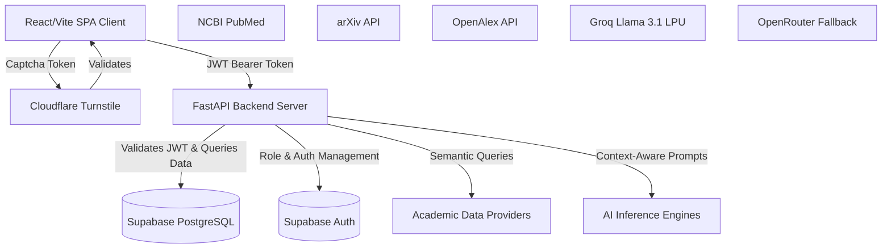
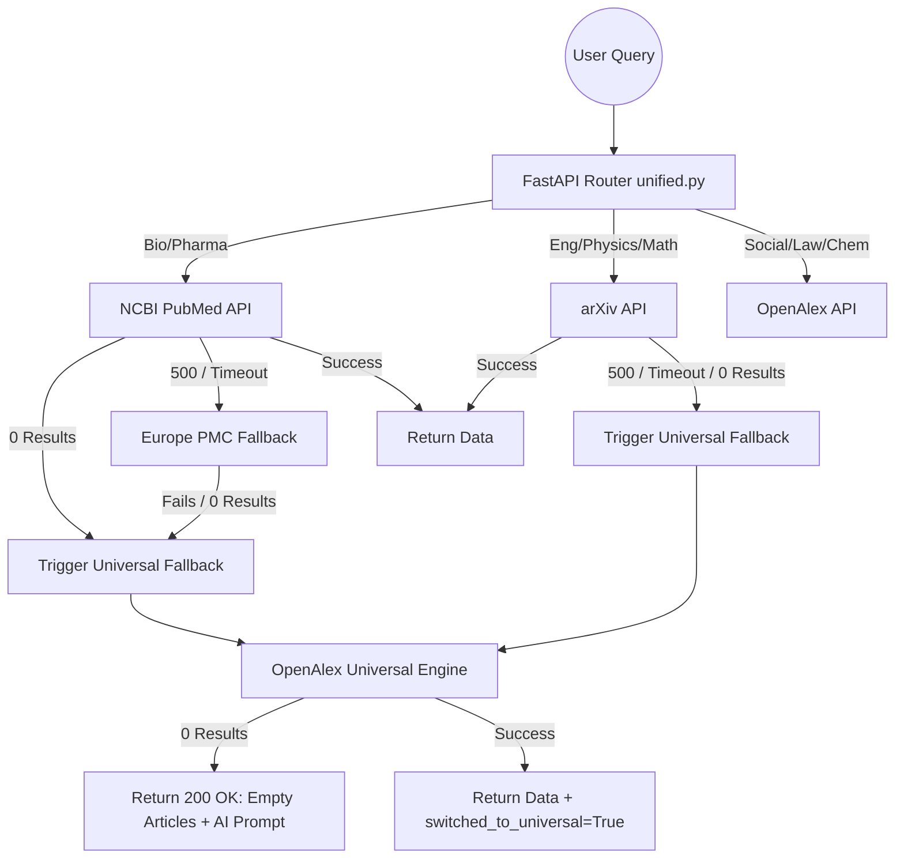
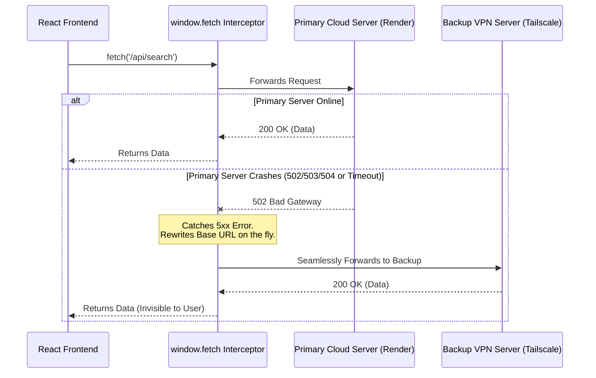
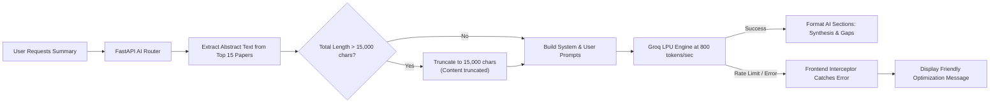
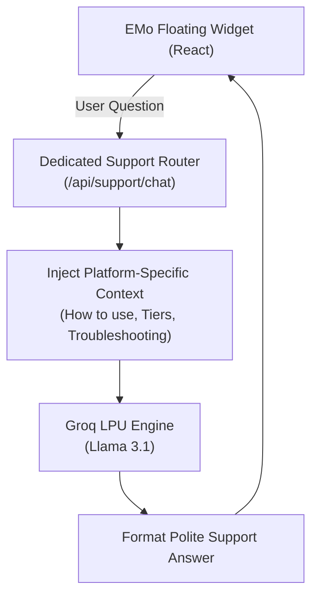
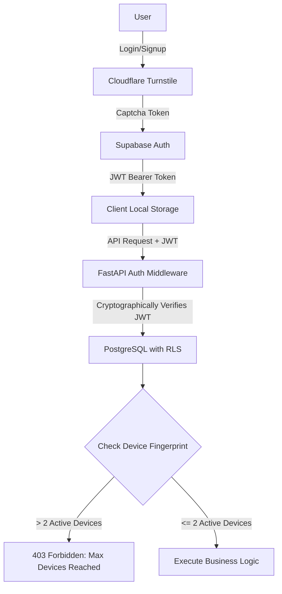
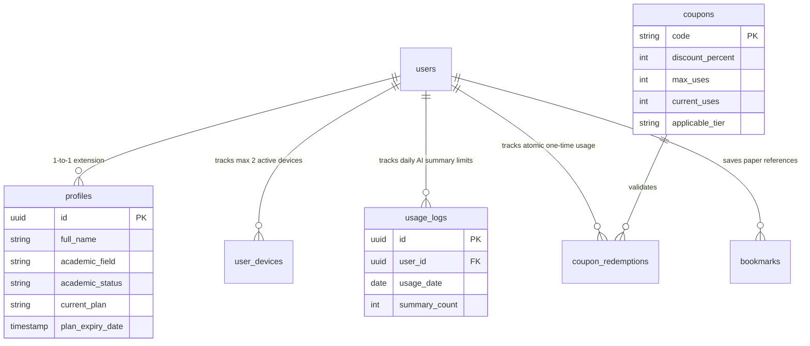
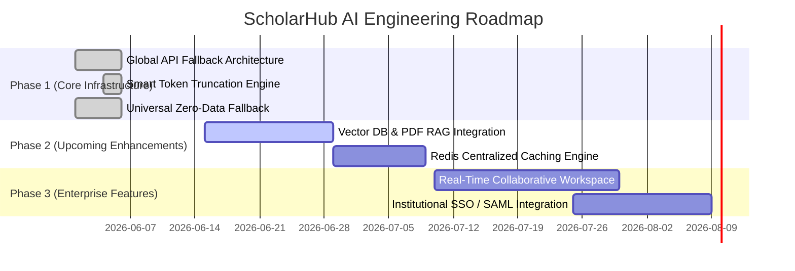

# 🏛️ ScholarHub AI: System Architecture Deep Dive

**An Enterprise-Grade Technical Reference**
*Target Audience: University Faculty, Senior Engineers, and System Architects.*

---

## 1. End-to-End System Architecture

ScholarHub AI is built on a highly decoupled, modern microservices-inspired architecture designed to ensure that heavy AI inferencing and massive data pulls do not bottleneck the client experience.

### Core Components:
- **Frontend Layer:** A highly reactive React SPA that handles all UI rendering, optimistic state management, and strict local caching to prevent redundant API calls.
- **Backend Service Layer:** A fully asynchronous Python (FastAPI) environment routing complex logic to third-party academic sources while acting as a secure gateway to the database.
- **AI Inference Layer:** Driven primarily by Groq's LPU architecture, achieving blazing fast inference (up to 800 tokens/sec) using Meta's Llama 3.1 8B Instruct model.

---

## 2. Multi-Source Data Waterfall

Querying legacy academic APIs is notoriously unstable. To provide uninterrupted service, the backend implements a highly resilient **Zero-Data & Error Fallback Cascade** located inside `routers/unified.py`.

### The `switched_to_universal` Flag Logic:
When the system silently reroutes a query from a failing or empty primary source (like NCBI) to the OpenAlex Universal engine, it sets `switched_to_universal = True`. This explicitly tells the frontend UI to display a polite banner informing the user: *"Primary database lacked results. Automatically expanded search globally."*

---

## 3. The 'Bulletproof' Hybrid Infrastructure

To guarantee 99.9% uptime despite utilizing free/hobby cloud tiers, we engineered a **Global Fetch Interceptor** directly into the React client (`utils/api.js`).

- **Seamless Rerouting:** The user experiences zero downtime. If the primary Render container undergoes a cold start crash or 502 Bad Gateway, the interceptor catches the failure and immediately routes to the local Tailscale Funnel node.
- **Third-Party Safety:** Strict string-matching ensures that external API calls (e.g., Supabase Auth or Turnstile) are never incorrectly rewritten.

---

## 4. AI Intelligence Layer & Smart Truncation

Processing highly complex academic texts via LLMs easily risks triggering HTTP 413 (Payload Too Large) or Token Rate Limit errors. To mitigate this, we implemented **Smart Truncation Logic** in the backend AI services (`routers/ai.py`).

By safely capping the total string payload to 15,000 characters (approximately 3,500 - 4,000 tokens), the system strictly obeys the 6,000 TPM limit set by our LLM provider, guaranteeing stability even for high-volume PRO users.

---

## 5. EMo: The Intelligent Support Assistant

ScholarHub AI features **EMo**, a dedicated, highly context-aware AI support bot designed to assist users with platform navigation, subscription tiers, and troubleshooting.

### Architectural Distinction: EMo vs. Research AI
While both AI assistants are powered by the same underlying Llama 3.1 infrastructure, their grounding methodologies are strictly separated:
- **The Research AI** (`/ai/summarize-research`) is dynamically grounded **only** in the academic papers retrieved during the user's current search session. It acts as an objective, academic scientist and refuses to answer questions outside of the provided literature.
- **EMo Support Bot** (`/api/support/chat`) is statically grounded in **platform documentation**. It is injected with a persistent system prompt detailing ScholarHub's portal logic, SaaS pricing models, error codes (like 413 or 502), and UI features. EMo acts as a friendly, empathetic customer success agent guiding the user through the application.

---

## 6. Security & SaaS Integrity Fortress

Security is woven into the foundation of the platform to protect API endpoints and subscription revenue.

### Key Security Layers:
1. **Stateless JWT Validation:** The backend never inherently trusts the client. Every protected endpoint rigorously checks the JWT signature against the Supabase core identity.
2. **Row Level Security (RLS):** Policies physically block unauthorized data operations at the PostgreSQL engine level, ensuring users can only read/write their own `usage_logs` and `user_devices`.
3. **Device Fingerprinting:** A custom tracking system generates robust browser fingerprints to enforce a maximum active device limit (e.g., 2 devices per PRO account), completely neutralizing account-sharing abuse.

---

## 7. Database Schema Entity-Relationship (ER) Diagram

The architecture relies heavily on strict relational integrity and foreign key cascading within Supabase.

---

## 8. Future Roadmap

Our infrastructure is highly modular, enabling rapid integration of complex future technologies.

---
*Document Generated by ScholarHub AI Architecture Audit Team. Validated against `routers/`, `utils/api.js`, and `middleware/` operational logic.*
