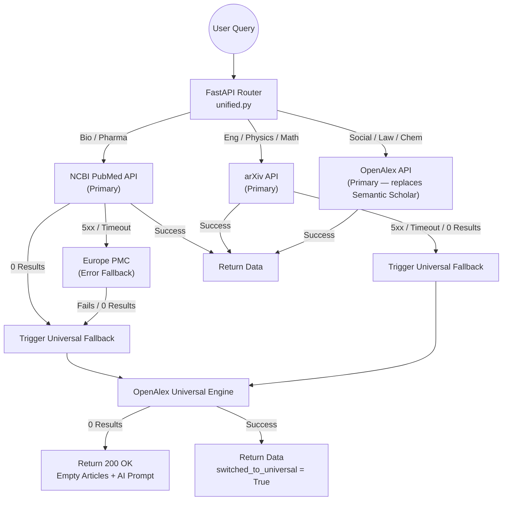
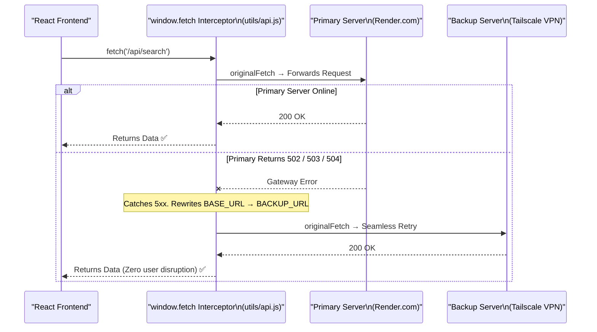
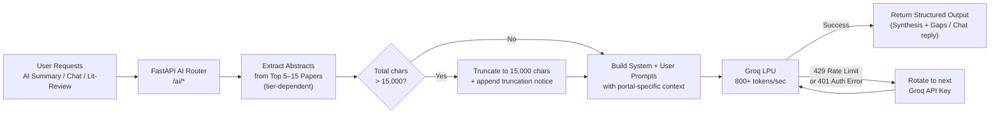
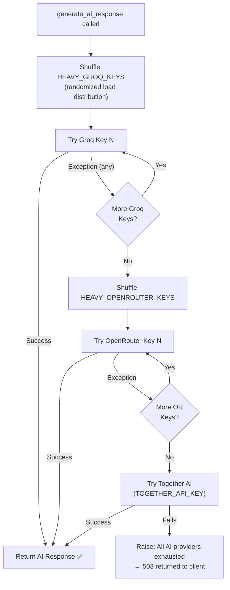
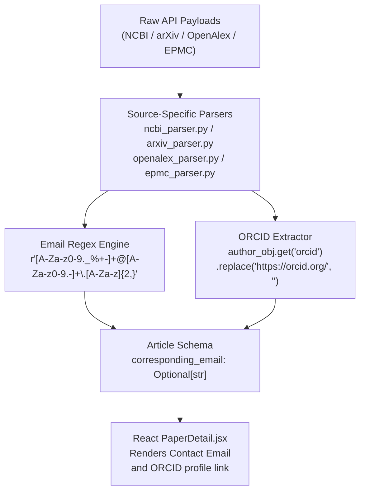
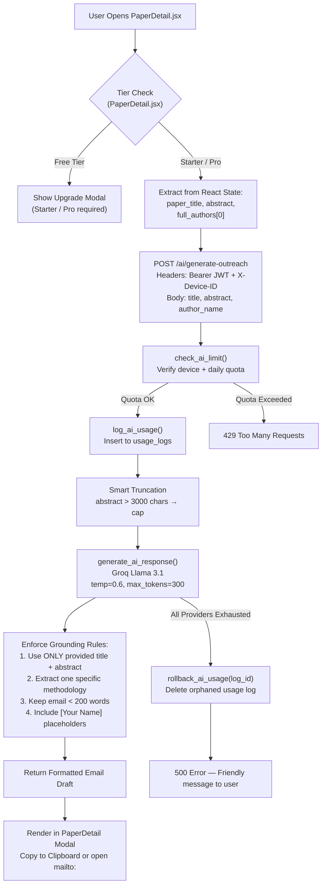
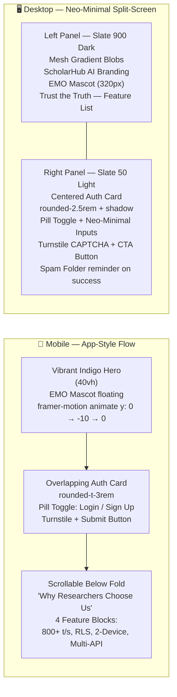
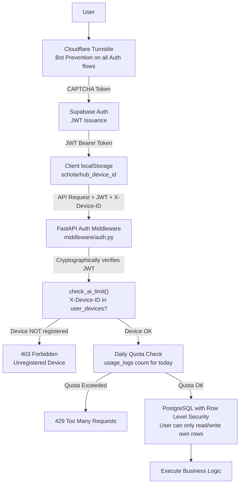
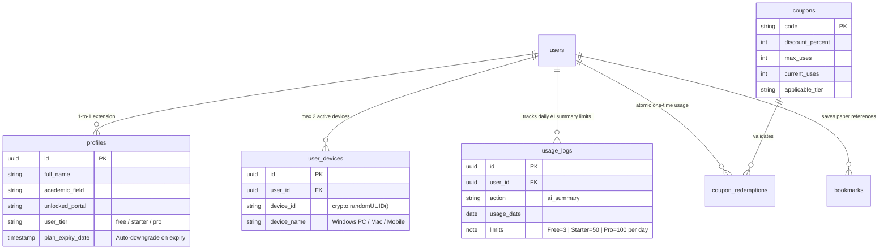
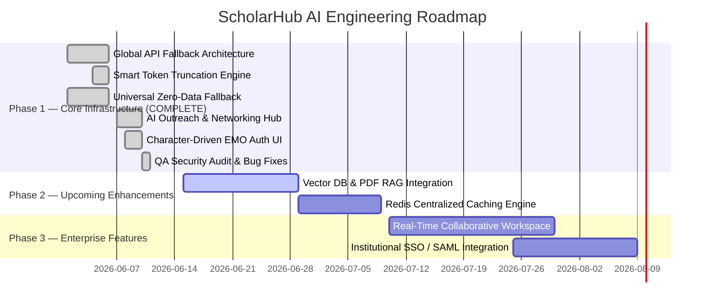

# 🏛️ ScholarHub AI: System Architecture Deep Dive

**An Enterprise-Grade Technical Reference**
*Target Audience: University Faculty, Senior Engineers, and System Architects.*
*Last Validated: June 2026 — against `utils/api.js`, `Auth.jsx`, `routers/ai.py`, `middleware/rate_limiter.py`, `parsers/openalex_parser.py`, and `components/PaperDetail.jsx`.*

---

## 1. End-to-End System Architecture

ScholarHub AI is built on a highly decoupled, modern microservices-inspired architecture designed to ensure that heavy AI inferencing and massive data pulls do not bottleneck the client experience.


### Core Components:
| Layer | Technology | Role |
|---|---|---|
| **Frontend** | React 19 / Vite / Tailwind CSS v4 | UI rendering, optimistic state, session-scoped caching |
| **Backend Gateway** | FastAPI (async Python) | Auth middleware, portal routing, AI orchestration |
| **AI Inference** | Groq LPU (Llama 3.1 8B Instruct) | 800+ tokens/sec synthesis, chat, outreach, lit-review |
| **Database** | Supabase PostgreSQL + RLS | User data, usage logs, device fingerprints, bookmarks |
| **Auth** | Supabase Auth + Cloudflare Turnstile | JWT issuance, CAPTCHA bot-prevention on all auth flows |

---

## 2. Multi-Source Data Waterfall & OpenAlex Promotion

Querying legacy academic APIs is notoriously unstable. To provide uninterrupted service, the backend implements a highly resilient **Zero-Data & Error Fallback Cascade** located inside `routers/unified.py`.

> **⚠️ Breaking Change (June 2026):** Following the **deprecation of Semantic Scholar's public API**, OpenAlex has been explicitly promoted to the **primary source** for the Social Sciences, Law, and Chemistry portals. It also serves as the universal fallback engine for all other portals.



### The `switched_to_universal` Flag:
When the backend silently reroutes to OpenAlex, it sets `switched_to_universal = True` in the `SearchResponse` schema. The React frontend reads this flag and renders a contextual banner: *"Primary database lacked results. Automatically expanded search globally."*

---

## 3. Bulletproof Hybrid Infrastructure & Resilience Fixes

To guarantee 99.9% uptime despite utilizing free/hobby cloud tiers, we engineered robust fallback mechanisms across the full stack.

### 3.1 — Global Fetch Interceptor (`utils/api.js`)

The custom `window.fetch` override captures the native fetch **before** patching, ensuring the backup call always uses `originalFetch`. This architectural decision makes an **infinite retry loop structurally impossible**.



**Anti-Loop Guarantee:** The backup call uses the pre-captured `originalFetch` reference — it does **not** re-enter the overridden `window.fetch`, making recursive loops architecturally impossible.

### 3.2 — Vercel SPA Rewrite (`vercel.json`)

Standard SPAs serve `index.html` only at the root. Navigating directly to `/research` or pressing refresh on `/paper/123` returns a **404 from Vercel's CDN** before React Router can intercept.

**Fix:** A catch-all rewrite rule in `vercel.json` offloads all server-side navigations back to `index.html`, leaving React Router to handle client-side routing.

```json
{
  "rewrites": [{ "source": "/(.*)", "destination": "/index.html" }]
}
```

### 3.3 — Intelligent Auth Event Filtering (`App.jsx`)

Supabase fires `TOKEN_REFRESHED` on every browser tab focus via its internal `visibilitychange` listener. Without filtering, this unmounts and re-mounts the entire component tree — wiping `ResearchPage` state, closing AI panels, and causing disruptive loading spinners.

**Fix:** `onAuthStateChange` now classifies events into two categories:

| Event Type | Events | Action |
|---|---|---|
| **Significant** | `SIGNED_IN`, `SIGNED_OUT`, `INITIAL_SESSION`, `USER_UPDATED`, `PASSWORD_RECOVERY` | Show loading spinner, refetch profile |
| **Silent** | `TOKEN_REFRESHED` | Silently update `user` object only — no re-render |

```javascript
// App.jsx — onAuthStateChange handler
const isSignificantEvent = (
  _event === 'SIGNED_IN' || _event === 'SIGNED_OUT' ||
  _event === 'INITIAL_SESSION' || _event === 'USER_UPDATED' ||
  _event === 'PASSWORD_RECOVERY'
);
if (isSignificantEvent) {
  setIsInitializing(true);
  fetchAndSetProfile(session?.user ?? null);
} else {
  // TOKEN_REFRESHED — silent update only
  if (isMounted && session?.user) setUser(session.user);
}
```

---

## 4. AI Intelligence Layer — Inference, Truncation & Key Rotation

### 4.1 — Smart Truncation Pipeline (`routers/ai.py`)

Processing long academic texts risks triggering HTTP 413 (Payload Too Large) or provider rate limits. The backend applies a deterministic truncation cap before prompt construction.



### 4.2 — Three-Tier AI Key Rotation (`services/ai_service.py`)

The `generate_ai_response()` function implements a resilient, provider-agnostic key rotation strategy. All keys are **randomly shuffled per request** to distribute load evenly.



---

## 5. Networking & Mentorship Hub — Contact & ORCID Extraction

The platform enables direct academic networking by parsing researcher contact data from raw API payloads at parse-time — no additional API requests required.

### 5.1 — Extraction Architecture

Data flows through a **parser-level extraction pipeline** embedded in each academic source's parser:



**Verified Extraction Sources:**
| Source | Email Field | ORCID Field |
|---|---|---|
| **OpenAlex** | `raw_affiliation_string` (regex) | `author.orcid` (direct) |
| **NCBI / PubMed** | Affiliation strings (regex) | Not consistently available |
| **arXiv** | Author affiliation text (regex) | Not consistently available |
| **Europe PMC** | Author correspondence field (regex) | Not consistently available |

All fields are declared `Optional[str] = None` in `models/schemas.py` — a `null` value from any source **never crashes the frontend**.

### 5.2 — AI Outreach Architect (`/ai/generate-outreach`)

The platform generates highly personalized outreach emails using **Context-Aware Grounding** — data already held in React component state is passed directly to the AI. No re-fetch of academic APIs is ever required, maximizing speed and minimizing costs.



---

## 6. Character-Driven UX & EMO Mascot System

ScholarHub AI deliberately diverges from sterile academic database aesthetics by implementing a fully character-driven, human-centered interface powered by the **EMO mascot**.

### 6.1 — The Evolution of EMO

| Stage | Description |
|---|---|
| **v1 — Generic Icon** | `<Smile />` Lucide icon in a plain indigo button |
| **v2 — Character Mascot** | Custom `EMO.png` with CSS drop-shadow, `framer-motion` breathing animation |
| **v3 — Premium Widget** | EMO rendered in a glassmorphic pill container with an indigo border glow, dismissible tooltip, and dual floating+breathing animation |

**Animation Specification (SupportBot.jsx — `framer-motion`):**
```javascript
// Breathing effect on floating button
animate={{ scale: [1, 1.05, 1], y: [0, -3, 0] }}
transition={{ duration: 2.5, repeat: Infinity, ease: 'easeInOut' }}

// Thinking animation during AI response generation
animate={{ scale: [1, 1.15, 1], rotate: [-5, 5, -5] }}
transition={{ repeat: Infinity, duration: 1.5, ease: 'easeInOut' }}
```

### 6.2 — Auth UI Redesign (`Auth.jsx`)

The authentication flow has been completely overhauled using a **responsive dual-layout** strategy:



**Security logic is preserved 100%** across both layouts: Cloudflare Turnstile is rendered in Step 1 for both Login and Signup flows, keeping the submit button `disabled` until `captchaToken` is populated.

---

## 7. Security & SaaS Integrity Fortress

Security is woven into the foundation of the platform to protect API endpoints and subscription revenue.



### Key Security Layers:

1. **Stateless JWT Validation** — Every protected endpoint verifies the JWT signature against Supabase Auth. No implicit trust.
2. **Row Level Security (RLS)** — PostgreSQL policies physically prevent cross-user data access at the engine level. Users can only access their own `usage_logs`, `user_devices`, and `bookmarks`.
3. **Device Fingerprinting** — `crypto.randomUUID()` generates a stable browser fingerprint stored in `localStorage`. The backend validates this on every AI request. Max 2 devices per account.
4. **Silent Device Sync (`deviceSync.js`)** — Runs idempotently in the background on `SIGNED_IN` and `INITIAL_SESSION` events to register devices that bypass `Auth.jsx` (e.g., email confirmation links).
5. **Global 402 Interception** — `apiFetch()` in `utils/api.js` catches HTTP 402 globally, fires a `scholarhub:session-expired` custom event, and immediately downgrades the client's profile tier to `free` without a page reload.

### Database Schema Entity-Relationship (ER) Diagram



---

## 8. Future Roadmap

Our infrastructure is highly modular, enabling rapid integration of complex future technologies.



---

*Document Generated by ScholarHub AI Architecture Audit Team.*
*Validated against: `utils/api.js`, `Auth.jsx`, `routers/ai.py`, `middleware/rate_limiter.py`, `parsers/openalex_parser.py`, `components/PaperDetail.jsx`, `utils/deviceSync.js`.*
*Last full QA audit: June 10, 2026. No known defects at time of publication.*
