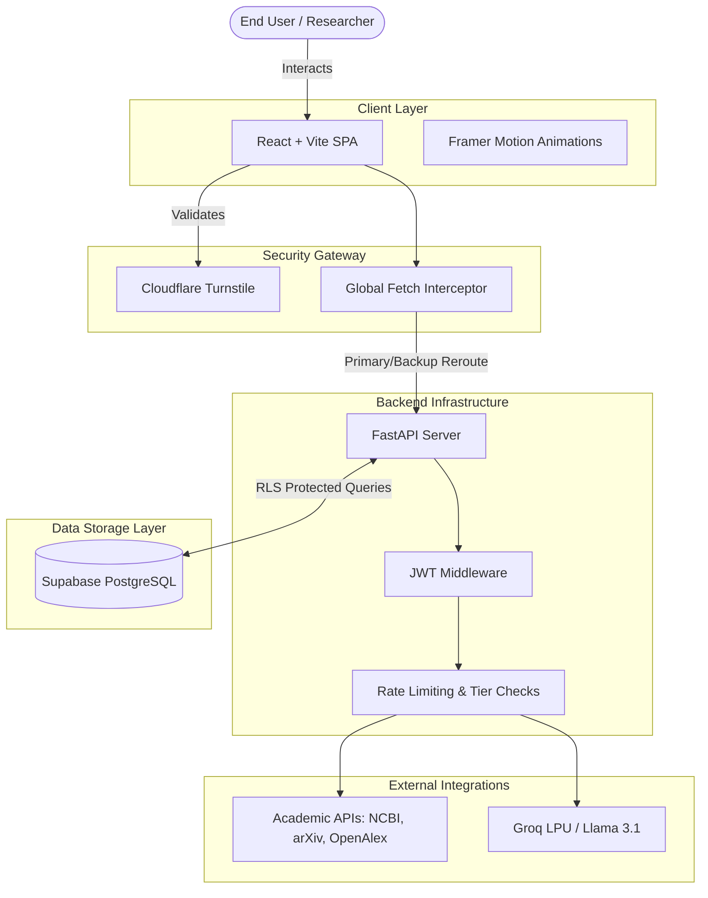
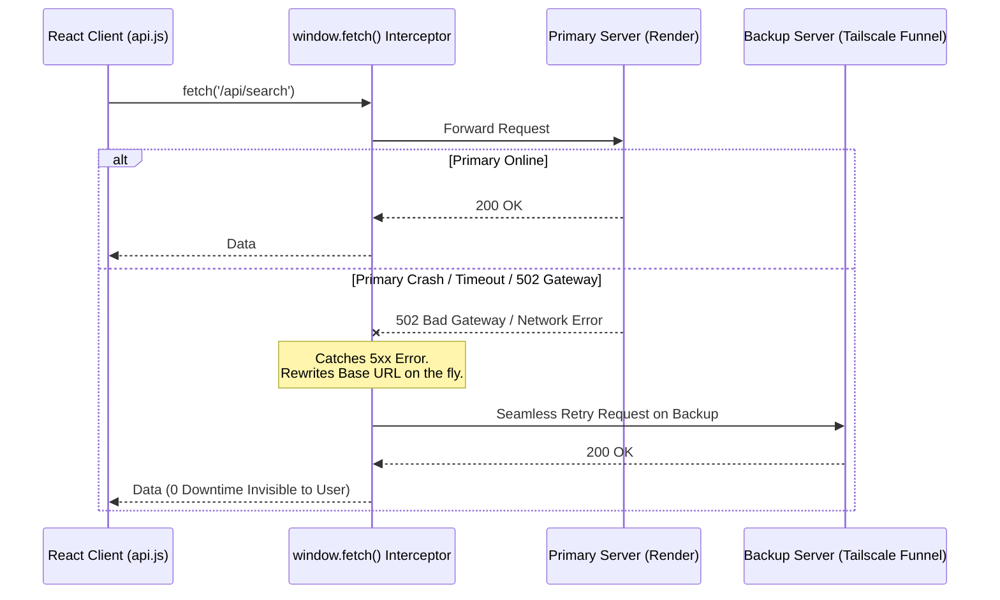
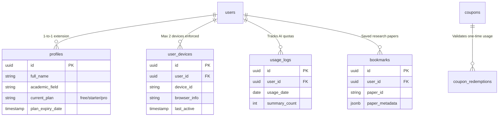
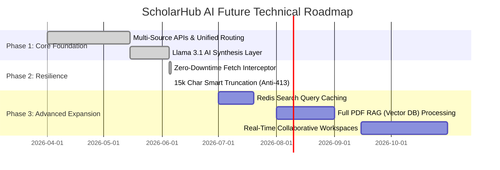

# 🏛️ ScholarHub AI: System Architecture Deep Dive
*Enterprise-Grade Technical Documentation*

**Document Purpose:** This document provides a comprehensive, high-level overview of the ScholarHub AI ecosystem. It is intended for university faculty, technical reviewers, and future contributors to understand the underlying infrastructure, security protocols, and robust fallback mechanisms that power the platform.

---

## 1. End-to-End System Architecture

ScholarHub AI is built on a highly decoupled, state-of-the-art tech stack. It separates the heavy AI inferencing and massive data pulls from the client experience, ensuring a buttery-smooth UX regardless of network strain.



---

## 2. Multi-Source Data Waterfall & Universal Fallback

Legacy academic APIs are notoriously unstable. To guarantee users always receive data, the `unified.py` router implements a sophisticated "Zero-Data & Error Fallback Cascade".

```mermaid
flowchart TD
    Start([User Submits Query]) --> Router[FastAPI Router - unified.py]
    Router --> CheckPortal{Which Portal?}
    
    CheckPortal -->|Bio/Pharma| NCBI[NCBI PubMed API]
    CheckPortal -->|Engineering/Physics| arXiv[arXiv API]
    CheckPortal -->|Social/Law/Chem| OpenAlex[OpenAlex API]
    
    NCBI --> HasData{Has Data?}
    arXiv --> HasData
    
    HasData -->|Yes| Format[Format & Return]
    HasData -->|Error / Timeout| EuropePMC[Europe PMC Fallback]
    
    EuropePMC --> EuropeHasData{Has Data?}
    EuropeHasData -->|Yes| Format
    
    HasData -->|No (0 Results)| UniversalFallback
    EuropeHasData -->|No/Error| UniversalFallback
    
    subgraph The Ultimate Safety Net
        UniversalFallback[OpenAlex Universal Engine]
        UniversalFallback --> UnivHasData{Has Data?}
        UnivHasData -->|Yes| SetFlag[Set 'switched_to_universal' = True]
        SetFlag --> Format
        UnivHasData -->|No| Empty[Return Polite 'AI Optimize' Suggestion]
    end
```

### 💡 The `switched_to_universal` Flag
When the backend falls back to OpenAlex due to a primary source failure, it flags the response with `"switched_to_universal": true`. The React frontend intercepts this flag and displays a polite, non-intrusive toast notification: *"Primary database was unavailable. Automatically switched to the Universal Database."* This ensures absolute transparency without frustrating the user.

---

## 3. The 'Bulletproof' Hybrid Infrastructure

To guarantee 99.9% uptime despite relying on free-tier cloud hosting (Render), we engineered a **Global Fetch Interceptor** in `utils/api.js`.


By intercepting the native `window.fetch` API globally, we protect every single backend call without rewriting individual React components. It specifically checks if the target is our backend, ensuring third-party APIs (like Supabase Auth) are never accidentally rewritten.

---

## 4. AI Intelligence Layer & Smart Truncation

ScholarHub utilizes **Meta's Llama 3.1 (8B Instruct)** model running on **Groq's LPU architecture** for blazing-fast inference (>800 tokens/second). However, LLMs have strict context window limits.

To prevent HTTP 413 (Payload Too Large) or Token Limit Exceeded errors, we implemented a **Smart Truncation** algorithm.

```mermaid
flowchart LR
    Frontend[Frontend Sends up to 15 Papers] --> Backend[Backend AI Router]
    Backend --> Extractor[Extract Titles & Abstracts]
    Extractor --> Measure{String > 15,000 chars?}
    
    Measure -->|Yes| Truncate[Smart Truncate to 15k<br/>Append '[Content truncated]']
    Measure -->|No| Pass[Keep Context Intact]
    
    Truncate --> Prompt[Inject into Llama 3.1 System Prompt]
    Pass --> Prompt
    
    Prompt --> Groq[Groq LPU Engine]
    Groq -->|800+ Tokens/sec| Response[Zero-Hallucination Response]
```
If an AI engine fails, the React frontend catches the error and gracefully displays a polite message instead of crashing or showing raw JSON to the user.

---

## 5. Security & SaaS Integrity Fortress

Security is handled via a defense-in-depth approach:

1. **Cloudflare Turnstile:** Stops bot-nets, DDoS, and credential stuffing at the frontend auth gates.
2. **Stateless JWT Validation:** `auth.py` middleware forces every API call to possess a cryptographically signed JWT. The backend inherently distrusts the frontend.
3. **Supabase RLS (Row Level Security):** PostgreSQL physically blocks users from SELECTing or UPDATEing data belonging to another UUID.
4. **Device Fingerprinting:**
   - On login, a unique `device_id` is generated and stored in local storage.
   - The `user_devices` table tracks active devices per user.
   - If a user logs into a 3rd device, the system automatically revokes the oldest session, preventing account sharing and revenue leakage.

---

## 6. Database Schema (Entity-Relationship)



---

## 7. Future Strategic Roadmap

The architectural foundation is highly scalable. The future roadmap focuses on extending context capabilities and caching optimizations.



<br />

<div align="center">
  <p><em>Engineered by Arup Bhowmik Pritom | Designed for massive scale.</em></p>
</div>
