# 🏛️ ScholarHub AI: System Architecture Deep Dive

**An Enterprise-Grade Technical Reference**
*Target Audience: University Faculty, Senior Engineers, and System Architects.*
*Last Validated: June 11, 2026 — against `utils/api.js`, `supabaseClient.js`, `Auth.jsx`, `routers/ai.py`, `routers/unified.py`, `middleware/rate_limiter.py`, `parsers/arxiv_parser.py`, `parsers/openalex_parser.py`, `components/PaperDetail.jsx`, `utils/deviceSync.js`, `vercel.json`, `main.py`, `config.py`.*

---

## Table of Contents

1. [End-to-End System Architecture](#1-end-to-end-system-architecture)
2. [Security & SaaS Integrity Fortress](#2-security--saas-integrity-fortress)  ← *Core Pillar — Read First*
3. [Multi-Source Data Waterfall](#3-multi-source-data-waterfall--openalex-promotion)
4. [Bulletproof Hybrid Infrastructure & Resilience](#4-bulletproof-hybrid-infrastructure--resilience-fixes)
5. [AI Intelligence Layer](#5-ai-intelligence-layer--inference-truncation--key-rotation)
6. [Networking & Mentorship Hub](#6-networking--mentorship-hub--contact--orcid-extraction)
7. [Character-Driven UX & EMO Mascot System](#7-character-driven-ux--emo-mascot-system)
8. [Database Schema](#8-database-schema--er-diagram)
9. [Future Roadmap](#9-future-roadmap)

---

## 1. End-to-End System Architecture

ScholarHub AI is built on a highly decoupled, modern microservices-inspired architecture designed to ensure that heavy AI inferencing and massive data pulls do not bottleneck the client experience.

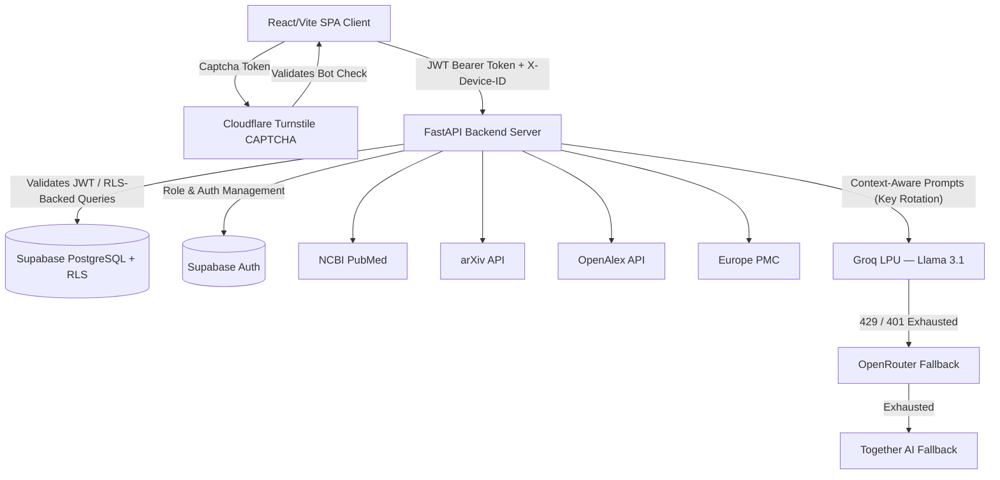

### Core Component Stack

| Layer | Technology | Role |
|---|---|---|
| **Frontend** | React 19 / Vite / Tailwind CSS v4 | UI rendering, optimistic state, session-scoped caching |
| **Backend Gateway** | FastAPI (async Python) | Auth middleware, portal routing, AI orchestration |
| **AI Inference** | Groq LPU (Llama 3.1 8B Instruct) | 800+ tokens/sec synthesis, chat, outreach, lit-review |
| **Database** | Supabase PostgreSQL + **RLS** | User data, usage logs, device fingerprints, bookmarks |
| **Auth** | Supabase Auth + Cloudflare Turnstile | JWT issuance, CAPTCHA bot-prevention on all auth flows |

---

## 2. Security & SaaS Integrity Fortress

> **This is the most critical architectural pillar.** Security is not a layer added on top — it is woven into every request lifecycle, from the first browser interaction through to database query execution.

### 2.1 — Full Security Request Lifecycle

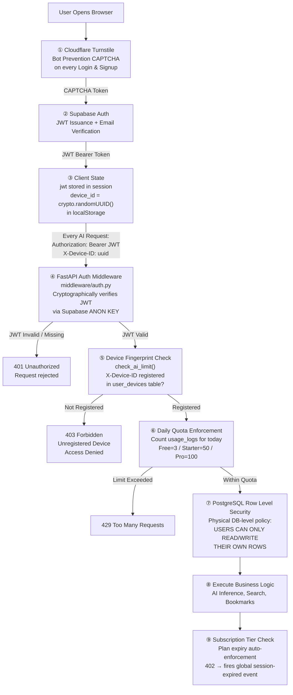

### 2.2 — The Five Security Pillars (Detailed)

#### ① Cloudflare Turnstile — Entry Gate
- CAPTCHA verification is required on **every** authentication action: Login, Sign Up, and Forgot Password.
- The `captchaToken` is sent directly to Supabase Auth's `signInWithPassword` and `signUp` options.
- The submit button remains **`disabled`** in React until `setCaptchaToken(token)` is populated via `onSuccess` callback.
- Prevents automated credential stuffing, bot signups, and brute-force attacks before a single database query is made.

#### ② Stateless JWT Validation — Identity Verification
- The FastAPI backend **never trusts the client**. Every protected endpoint calls the Supabase Auth server to verify the JWT cryptographic signature.
- Token validity is checked per-request using the `SUPABASE_ANON_KEY` as the verification key.
- There is no session cookie, no server-side session store — the system is fully stateless and horizontally scalable.

```python
# middleware/auth.py — JWT verification pattern
user_res = requests.get(
    f"{SUPABASE_URL}/auth/v1/user",
    headers={"Authorization": f"Bearer {token}", "apikey": SUPABASE_ANON_KEY}
)
```

#### ③ PostgreSQL Row Level Security (RLS) — Data Isolation Fortress
- RLS policies are enforced at the **PostgreSQL engine level** — not in application code. This means even a compromised backend cannot read another user's data without correct identity credentials.
- **Enforced tables:** `usage_logs`, `user_devices`, `bookmarks`, `coupon_redemptions`.
- Policy pattern: `USING (auth.uid() = user_id)` — a user's JWT is transparently compared against the `user_id` column on every SELECT, INSERT, UPDATE, and DELETE.
- The service role key (`SUPABASE_SERVICE_KEY`) is used **only** for admin operations (usage counting, device upsert) and is never exposed to the client.

#### ④ Device Fingerprinting — Account Integrity Enforcement
- On first login, `crypto.randomUUID()` generates a stable UUID stored in `localStorage` under the key `scholarhub_device_id`.
- This ID is sent as `X-Device-ID` header on every AI endpoint request.
- The backend's `check_ai_limit()` middleware queries `user_devices` to verify registration before allowing any AI operation.
- **Maximum 2 devices** per account. A 3rd device receives a `403 Forbidden` response, blocking feature access without signing out of existing devices.
- `deviceSync.js` runs silently in the background via `App.jsx`'s `onAuthStateChange` listener to register devices that bypass `Auth.jsx` (e.g., email confirmation link flows).

#### ⑤ Global 402 Session Expiry Interception
- `apiFetch()` in `utils/api.js` intercepts every HTTP 402 response globally.
- On detection, it fires a custom DOM event `scholarhub:session-expired` which `App.jsx` listens for.
- `App.jsx` immediately downgrades the global profile state to `'free'` tier without a page reload, preserving all current UI state.
- The `rate_limiter.py` backend automatically patches `profiles.user_tier = 'free'` and clears `plan_expiry_date` on detection of an expired plan.

### 2.3 — SaaS Quota Enforcement Summary

| Tier | Daily AI Summaries | Portals | Devices |
|---|---|---|---|
| **Free** | 3 / day | 1 (field-locked) | 2 |
| **Starter** | 50 / day | 1 (field-locked) | 2 |
| **Pro** | 100 / day | All 7 portals | 2 |

### 2.4 — ISO Timestamp Parsing Resilience (`safe_fromisoformat`)

Supabase PostgreSQL returns timestamps with **arbitrary fractional-second precision** (e.g. `2026-07-11T13:53:24.3504+00:00` — 4-digit fractional). Python's strict `datetime.fromisoformat()` only accepts exactly 0, 3, or 6 fractional digits, causing a `ValueError` crash in the plan expiry auto-downgrade middleware.

**Fix:** A centralized `safe_fromisoformat()` helper in `middleware/rate_limiter.py` normalizes fractional seconds to exactly 6 digits before parsing:

```python
def safe_fromisoformat(date_str: str) -> datetime:
    s = date_str.replace('Z', '+00:00')
    if '.' in s:
        parts = s.split('.')
        before_dot = parts[0]
        after_dot = parts[1]
        # Find timezone offset in fractional part
        tz_index = next((after_dot.find(sym) for sym in ('+', '-') if after_dot.find(sym) != -1), -1)
        if tz_index != -1:
            frac = after_dot[:tz_index]
            tz = after_dot[tz_index:]
        else:
            frac = after_dot
            tz = ''
        frac = (frac + '000000')[:6]  # Pad/truncate to exactly 6 digits
        s = f"{before_dot}.{frac}{tz}"
    return datetime.fromisoformat(s)
```

**Applied in:**
- `middleware/rate_limiter.py` → `get_user_tier()` and `verify_portal_access()` (plan expiry auto-downgrade)
- `routers/unified.py` → `redeem_coupon()` (coupon expiry validation)
- `parsers/arxiv_parser.py` → Inline normalization for publication date strings

---

## 3. Multi-Source Data Waterfall & OpenAlex Promotion

Querying legacy academic APIs is notoriously unstable. To provide uninterrupted service, the backend implements a highly resilient **Zero-Data & Error Fallback Cascade** inside `routers/unified.py`.

> **Breaking Change (June 2026):** Following the **deprecation of Semantic Scholar's public API**, OpenAlex has been explicitly promoted to the **primary source** for Social Sciences, Law, and Chemistry portals. It also serves as the universal fallback engine for all other portals.

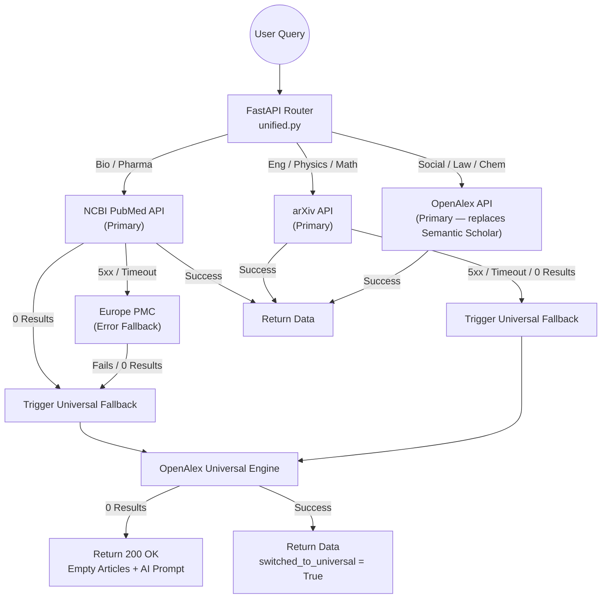

### The `switched_to_universal` Flag:
When the backend silently reroutes to OpenAlex, it sets `switched_to_universal = True` in `SearchResponse`. The React frontend reads this flag and renders a contextual banner: *"Primary database lacked results. Automatically expanded search globally."*

---

## 4. Bulletproof Hybrid Infrastructure & Resilience Fixes

### 4.1 — Global Fetch Interceptor (`utils/api.js`)

The custom `window.fetch` override captures the native fetch **before** patching, ensuring the backup call always uses `originalFetch`. This makes an **infinite retry loop structurally impossible**.

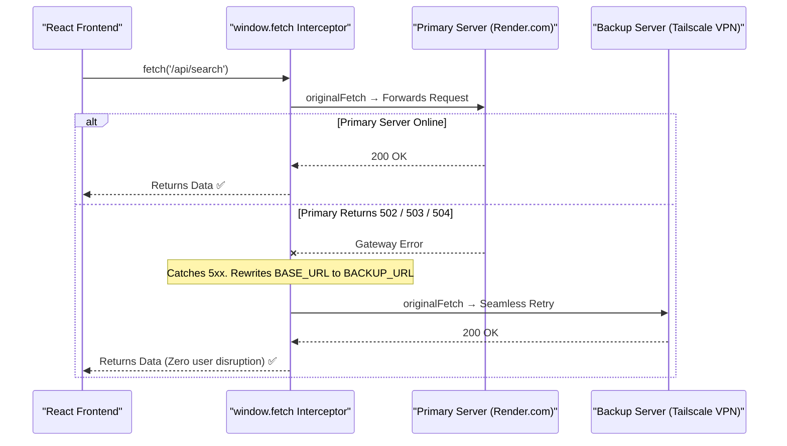

### 4.2 — Vercel SPA Rewrite (`vercel.json`)

Navigating directly to `/research` or refreshing `/paper/123` returns a 404 from Vercel's CDN before React Router can intercept. A catch-all rewrite rule resolves this:

```json
{
  "rewrites": [{ "source": "/(.*)", "destination": "/index.html" }]
}
```

### 4.3 — Intelligent Auth Event Filtering (`App.jsx`)

Supabase fires `TOKEN_REFRESHED` on every browser tab focus, which without filtering, re-mounts the entire component tree — wiping `ResearchPage` state and causing disruptive loading spinners.

| Event Type | Events | Action |
|---|---|---|
| **Significant** | `SIGNED_IN`, `SIGNED_OUT`, `INITIAL_SESSION`, `USER_UPDATED`, `PASSWORD_RECOVERY` | Show loading spinner, re-fetch profile |
| **Silent** | `TOKEN_REFRESHED` | Silently update `user` object only — no re-render |

```javascript
// App.jsx — onAuthStateChange handler
const isSignificantEvent = (
  _event === 'SIGNED_IN' || _event === 'SIGNED_OUT' ||
  _event === 'INITIAL_SESSION' || _event === 'USER_UPDATED' ||
  _event === 'PASSWORD_RECOVERY'
);
if (isSignificantEvent) {
  setIsInitializing(true);
  fetchAndSetProfile(session?.user ?? null);
} else {
  // TOKEN_REFRESHED — silent update only
  if (isMounted && session?.user) setUser(session.user);
}
```

---

## 5. AI Intelligence Layer — Inference, Truncation & Key Rotation

### 5.1 — Smart Truncation Pipeline (`routers/ai.py`)

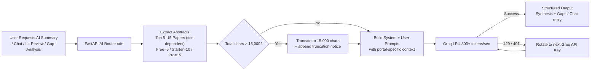

### 5.2 — Three-Tier AI Key Rotation (`services/ai_service.py`)

All keys are **randomly shuffled per request** to distribute load evenly across keys. Exceptions are caught generically — the rotation loop handles 429 (rate limit), 401 (auth failure), and network timeouts identically.

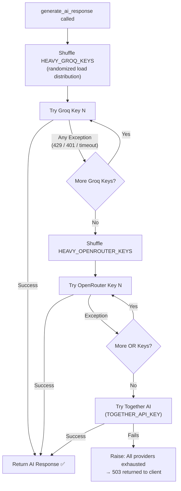

---

## 6. Networking & Mentorship Hub — Contact & ORCID Extraction

### 6.1 — Parser-Level Extraction Pipeline

Researcher contact data is extracted at **parse-time** from raw API payloads — no additional API requests are needed.

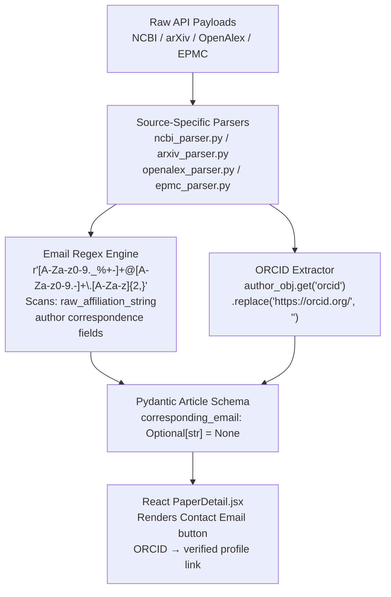

| Source | Email Field | ORCID Field |
|---|---|---|
| **OpenAlex** | `raw_affiliation_string` (regex) | `author.orcid` (direct field) |
| **NCBI / PubMed** | Affiliation strings (regex) | Not consistently available |
| **arXiv** | Author affiliation text (regex) | Not consistently available |
| **Europe PMC** | Author correspondence field (regex) | Not consistently available |

> All fields are `Optional[str] = None` in `models/schemas.py`. A `null` from any source **never crashes the frontend.**

### 6.2 — AI Outreach Architect (`POST /ai/generate-outreach`)

Personalized outreach emails are generated using **Context-Aware Grounding** — data already in React state is passed directly, eliminating any re-fetch of academic APIs.

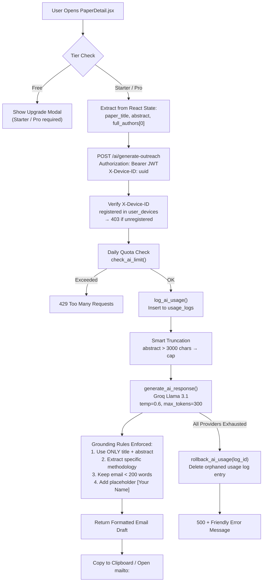

---

## 7. Character-Driven UX & EMO Mascot System

### 7.1 — The Evolution of EMO

| Version | Description |
|---|---|
| **v1 — Generic Icon** | `<Smile />` Lucide icon in a plain indigo circular button |
| **v2 — Character Mascot** | Custom `EMO.png` with `drop-shadow-2xl`, `framer-motion` infinite float animation |
| **v3 — Premium Widget** | EMO in a glassmorphic pill container, indigo border glow, dismissible "Need help?" tooltip, dual floating + breathing animation |

**Verified Animation Spec (`SupportBot.jsx`):**
```javascript
// Floating button — breathing effect
animate={{ scale: [1, 1.05, 1], y: [0, -3, 0] }}
transition={{ duration: 2.5, repeat: Infinity, ease: 'easeInOut' }}

// Chat header — thinking animation during AI response
animate={{ scale: [1, 1.15, 1], rotate: [-5, 5, -5] }}
transition={{ repeat: Infinity, duration: 1.5, ease: 'easeInOut' }}
```

### 7.2 — Auth UI Redesign (`Auth.jsx`)

The authentication flow uses a **responsive dual-layout** strategy validated against real device breakpoints:

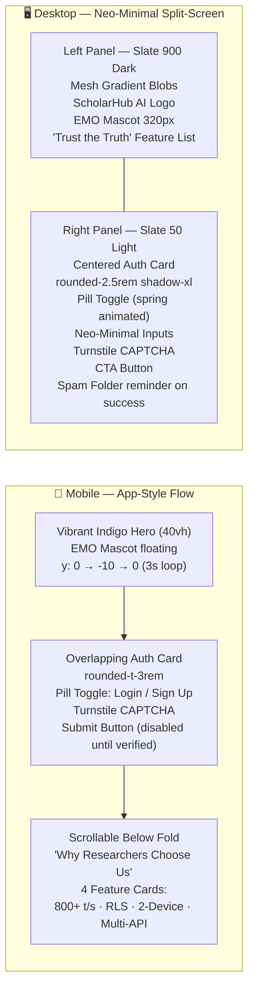

> **100% Functional Parity:** Cloudflare Turnstile is rendered in Step 1 for both Login AND Signup. The submit button is `disabled` until `captchaToken` is set. Supabase Auth, device sync, and all error handling remain intact across both layouts.

---

## 8. Database Schema & ER Diagram

The architecture relies on strict relational integrity and PostgreSQL RLS policies within Supabase.

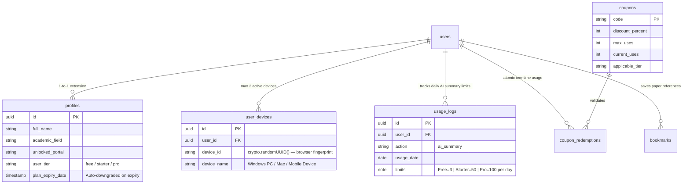

---

## 9. Future Roadmap

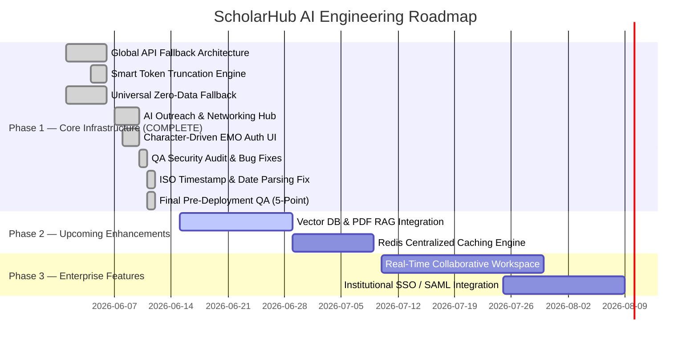

---

*Document Generated by ScholarHub AI Architecture Audit Team.*
*Validated against: `utils/api.js`, `supabaseClient.js`, `Auth.jsx`, `routers/ai.py`, `routers/unified.py`, `middleware/rate_limiter.py`, `parsers/arxiv_parser.py`, `parsers/openalex_parser.py`, `components/PaperDetail.jsx`, `utils/deviceSync.js`, `vercel.json`, `main.py`, `config.py`, `models/schemas.py`.*
*Last full QA audit: June 11, 2026. All 5 integration points verified — **GO status confirmed**. No known defects at time of publication.*
