# 🏛️ ScholarHub AI: Enterprise System Architecture Deep Dive

**The Definitive Technical Specification, High-Throughput Topology & Engineering Blueprint**  
*Target Audience: University Faculty, Senior Systems Architects, Engineering Evaluators, and Technical Recruiters.*  
*Current Production Baseline: Fully Synchronized with Live Codebase (`frontend/`, `backend/`, `routers/`, `services/`, `uve/`, `retrievers/`).*

---

## 📑 Complete Architectural Index

1. [Executive Summary & High-Level Philosophy](#1-executive-summary--high-level-philosophy)
2. [End-to-End Distributed System Topology](#2-end-to-end-distributed-system-topology)
3. [Omni-Source Federated Retrieval & Fuzzy Deduplication Engine](#3-omni-source-federated-retrieval--fuzzy-deduplication-engine)
4. [Dense Vector Search & Semantic Memory Layer (Upstash Vector 768-D)](#4-dense-vector-search--semantic-memory-layer-upstash-vector-768-d)
5. [Upstash Redis Serverless Caching, Queues & Circuit Breakers](#5-upstash-redis-serverless-caching-queues--circuit-breakers)
6. [Cognitive AI Reasoning Pipeline & Research Auditor Engine](#6-cognitive-ai-reasoning-pipeline--research-auditor-engine)
7. [Universal Visualization Engine (UVE) Multi-Engine Dispatcher](#7-universal-visualization-engine-uve-multi-engine-dispatcher)
8. [Multimodal Vision RAG & Document Ingestion System](#8-multimodal-vision-rag--document-ingestion-system)
9. [Continuous Intelligence Hubs (Academy, Opportunities, News)](#9-continuous-intelligence-hubs-academy-opportunities-news)
10. [Admin Control Plane, Telemetry & Realtime WebSockets](#10-admin-control-plane-telemetry--realtime-websockets)
11. [Hardware-Enforced 2-Device Policy & Zero-Trust Security](#11-hardware-enforced-2-device-policy--zero-trust-security)
12. [Comprehensive Database Schema, DDL & Entity-Relationship Model](#12-comprehensive-database-schema-ddl--entity-relationship-model)
13. [Frontend State Management & Zero-Jitter Render Pipeline](#13-frontend-state-management--zero-jitter-render-pipeline)
14. [Academic Recognition & Leadership Commendations](#14-academic-recognition--leadership-commendations)

---

## 1. Executive Summary & High-Level Philosophy

**ScholarHub AI** is an enterprise-grade academic research intelligence and systematic literature synthesis platform. It unifies **250+ Million research works** across global databases into a single, federated discovery layer, pairing real-time bibliographic ingestion with an autonomous **Cognitive AI Reasoning Auditor** and a **Universal Visualization Engine (UVE)**.

```mermaid
graph LR
    subgraph DataMesh ["🌐 Global Bibliographic Mesh (250M+ Works)"]
        PubMed["NCBI PubMed & PMC"]
        arXiv["arXiv Preprints"]
        OpenAlex["OpenAlex Global Works"]
        EuropePMC["Europe PMC"]
        Unpaywall["Unpaywall Open Access"]
        CrossRef["CrossRef DOI & ORCID"]
    end

    subgraph CoreEngine ["⚡ ScholarHub Unified Core"]
        Federation["Federated Asynchronous Query Fanout"]
        Deduplication["Fuzzy Levenshtein & DOI Normalizer"]
        Quartiles["SJR Journal Quartile Classifier (Q1-Q4)"]
        VectorDB["768-D Dense Vector Semantic Store"]
        Cognitive["Cognitive Intent & Evidence Extractor"]
        Auditor["Deep Tier CoT Research Auditor"]
    end

    subgraph VisualMesh ["📊 Universal Visualization Engine (UVE)"]
        Mermaid["Mermaid.js Flowcharts & PRISMA"]
        ECharts["Apache ECharts Statistical Plots"]
        ReactFlow["React Flow Mind Maps & Ontologies"]
        D3["D3.js Citation & Author Networks"]
        Tables["Data Matrices (.XLSX Export)"]
    end

    DataMesh --> CoreEngine
    CoreEngine --> VisualMesh
```

### Core Architecture Pillars:
1. **Strict Ground-Truth Provenance:** Every claim is backed by explicit citation bracket tags (`[1]`, `[2]`), quote verification, and contextual relevance scores (0–100%).
2. **Multi-Engine Visual Synthesis:** Dynamically routes data into the optimal visual engine without manual configuration.
3. **Resilience Shield:** 3-strike circuit breakers with automatic fallback across multi-provider LLMs (Groq LPU Llama 3.3/3.1 $\rightarrow$ OpenRouter $\rightarrow$ Together AI) and distributed Redis/Vector layers.
4. **Hardware Device Licensing:** 2-Device active session limit enforced via cryptographic browser fingerprinting and instant server-side session revocation.

---

## 2. End-to-End Distributed System Topology

The platform is designed around a decoupled, microservices-inspired architecture running on an asynchronous **FastAPI** Python 3.11+ backend and a **React 18 + Vite 5** SPA frontend.

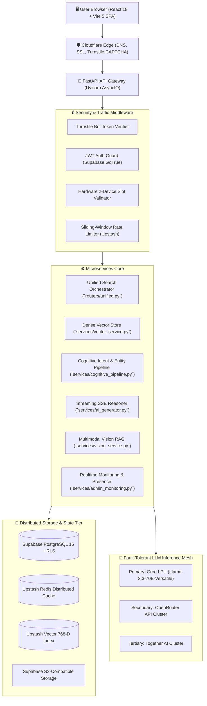
```mermaid
graph TD
    Client["🖥️ User Browser (React 18 + Vite 5 SPA)"]
    Cloudflare["🛡️ Cloudflare Edge (DNS, SSL, Turnstile CAPTCHA)"]
    FastAPIGateway["🚪 FastAPI API Gateway (Uvicorn AsyncIO)"]
    
    subgraph MiddlewareMesh ["🔒 Security & Traffic Middleware"]
        TurnstileValidator["Turnstile Bot Token Verifier"]
        JWTAuthenticator["JWT Auth Guard (Supabase GoTrue)"]
        DeviceSlotGuard["Hardware 2-Device Slot Validator"]
        SlidingRateLimiter["Sliding-Window Rate Limiter (Upstash)"]
    end

    subgraph CoreServicesMesh ["⚙️ Microservices Core"]
        UnifiedSearchSvc["Unified Search Orchestrator (`routers/unified.py`)"]
        VectorMemorySvc["Dense Vector Store (`services/vector_service.py`)"]
        CognitiveSvc["Cognitive Intent & Entity Pipeline (`services/cognitive_pipeline.py`)"]
        AIGeneratorSvc["Streaming SSE Reasoner (`services/ai_generator.py`)"]
        VisionRAGSvc["Multimodal Vision RAG (`services/vision_service.py`)"]
        AdminTelemetrySvc["Realtime Monitoring & Presence (`services/admin_monitoring.py`)"]
    end

    subgraph DataStorageTier ["💾 Distributed Storage & State Tier"]
        SupabaseDB[("Supabase PostgreSQL 15 + RLS")]
        UpstashRedis[("Upstash Redis Distributed Cache")]
        UpstashVector[("Upstash Vector 768-D Index")]
        SupabaseStorage["Supabase S3-Compatible Storage"]
    end

    subgraph InferenceCluster ["🧠 Fault-Tolerant LLM Inference Mesh"]
        GroqLPU["Primary: Groq LPU (Llama-3.3-70B-Versatile)"]
        OpenRouterFailover["Secondary: OpenRouter API Cluster"]
        TogetherFailover["Tertiary: Together AI Cluster"]
    end

    Client --> Cloudflare
    Cloudflare --> FastAPIGateway
    FastAPIGateway --> MiddlewareMesh
    MiddlewareMesh --> CoreServicesMesh

    CoreServicesMesh --> DataStorageTier
    CoreServicesMesh --> InferenceCluster
```

---

## 3. Omni-Source Federated Retrieval & Fuzzy Deduplication Engine

The unified search pipeline (`backend/routers/unified.py`, `backend/retrievers/`) aggregates research across disparate protocols (REST, XML-RPC, OpenSearch) concurrently.

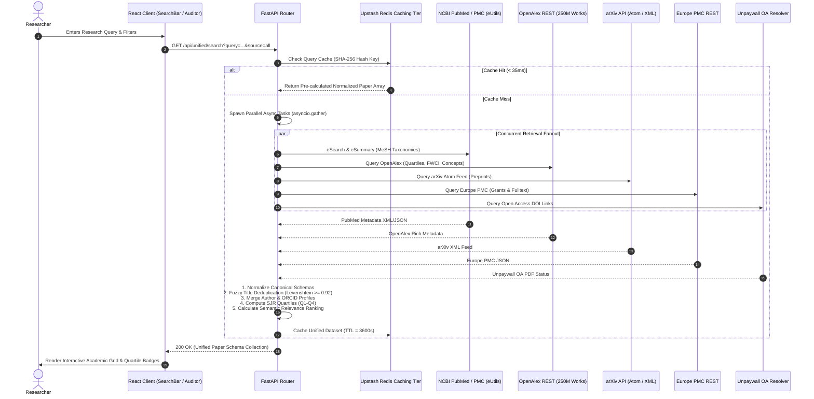
```mermaid
sequenceDiagram
    autonumber
    actor User as Researcher
    participant Client as React Client (SearchBar / Auditor)
    participant Gateway as FastAPI Router
    participant Redis as Upstash Redis Caching Tier
    participant PubMed as NCBI PubMed / PMC (eUtils)
    participant OpenAlex as OpenAlex REST (250M Works)
    participant ArXiv as arXiv API (Atom / XML)
    participant EuropePMC as Europe PMC REST
    participant Unpaywall as Unpaywall OA Resolver

    User->>Client: Enters Research Query & Filters
    Client->>Gateway: GET /api/unified/search?query=...&source=all
    Gateway->>Redis: Check Query Cache (SHA-256 Hash Key)
    alt Cache Hit (< 35ms)
        Redis-->>Gateway: Return Pre-calculated Normalized Paper Array
    else Cache Miss
        Gateway->>Gateway: Spawn Parallel Async Tasks (asyncio.gather)
        par Concurrent Retrieval Fanout
            Gateway->>PubMed: eSearch & eSummary (MeSH Taxonomies)
            Gateway->>OpenAlex: Query OpenAlex (Quartiles, FWCI, Concepts)
            Gateway->>ArXiv: Query arXiv Atom Feed (Preprints)
            Gateway->>EuropePMC: Query Europe PMC (Grants & Fulltext)
            Gateway->>Unpaywall: Query Open Access DOI Links
        end
        PubMed-->>Gateway: PubMed Metadata XML/JSON
        OpenAlex-->>Gateway: OpenAlex Rich Metadata
        ArXiv-->>Gateway: arXiv XML Feed
        EuropePMC-->>Gateway: Europe PMC JSON
        Unpaywall-->>Gateway: Unpaywall OA PDF Status

        Gateway->>Gateway: 1. Normalize Canonical Schemas<br/>2. Fuzzy Title Deduplication (Levenshtein >= 0.92)<br/>3. Merge Author & ORCID Profiles<br/>4. Compute SJR Quartiles (Q1-Q4)<br/>5. Calculate Semantic Relevance Ranking
        Gateway->>Redis: Cache Unified Dataset (TTL = 3600s)
    end
    Gateway-->>Client: 200 OK (Unified Paper Schema Collection)
    Client->>User: Render Interactive Academic Grid & Quartile Badges
```

### Mathematical Formulation for Deduplication:
$$\text{LevenshteinSimilarity}(T_1, T_2) = 1 - \frac{\text{LevenshteinDistance}(T_1, T_2)}{\max(|T_1|, |T_2|)}$$
If $\text{LevenshteinSimilarity} \ge 0.92$ or $\text{DOI}(P_1) == \text{DOI}(P_2)$, the records are merged into a canonical record.

---

## 4. Dense Vector Search & Semantic Memory Layer (Upstash Vector 768-D)

The **Vector Service** (`backend/services/vector_service.py`) provides persistent long-term semantic memory and similarity clustering.

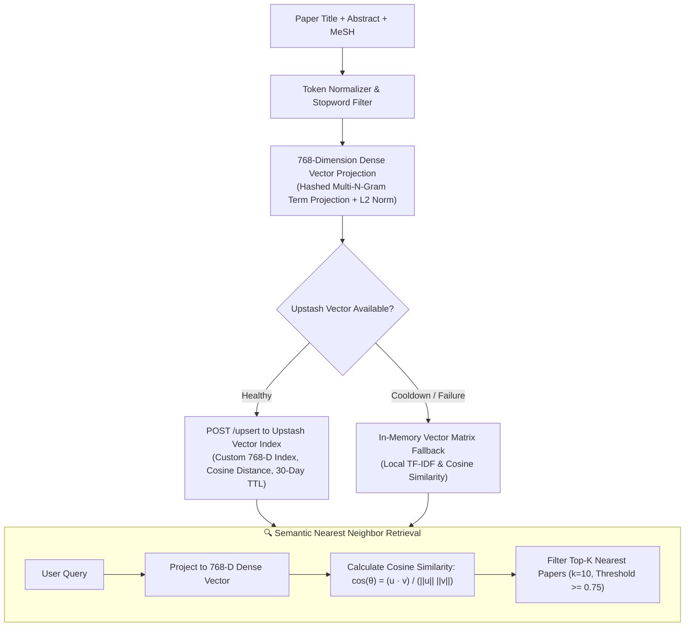
```mermaid
graph TD
    PaperAbstract["Paper Title + Abstract + MeSH"] --> Tokenizer["Token Normalizer & Stopword Filter"]
    
    Tokenizer --> VectorGen["768-Dimension Dense Vector Projection<br/>(Hashed Multi-N-Gram Term Projection + L2 Norm)"]
    
    VectorGen --> CircuitCheck{"Upstash Vector Available?"}
    
    CircuitCheck -->|Healthy| UpstashAPI["POST /upsert to Upstash Vector Index<br/>(Custom 768-D Index, Cosine Distance, 30-Day TTL)"]
    CircuitCheck -->|Cooldown / Failure| MemoryIndex["In-Memory Vector Matrix Fallback<br/>(Local TF-IDF & Cosine Similarity)"]

    subgraph QueryExecution ["🔍 Semantic Nearest Neighbor Retrieval"]
        SearchQuery["User Query"] --> QueryVec["Project to 768-D Dense Vector"]
        QueryVec --> CosineCalc["Calculate Cosine Similarity: cos(θ) = (u · v) / (||u|| ||v||)"]
        CosineCalc --> TopK["Filter Top-K Nearest Papers (k=10, Threshold >= 0.75)"]
    end

    UpstashAPI --> QueryExecution
    MemoryIndex --> QueryExecution
```

- **Vector Dimension:** 768 float components, normalized with unit Euclidean norm ($\|v\|_2 = 1$).
- **Similarity Metric:** Cosine similarity with automatic circuit breaker cooldown (60s).
- **Automated Lifecycle:** 30-day automated TTL metadata expiration on stored vector nodes.

---

## 5. Upstash Redis Serverless Caching, Queues & Circuit Breakers

The caching tier (`backend/services/redis_service.py`, `backend/services/upstash_mgmt_service.py`) safeguards backend throughput against burst university workloads.

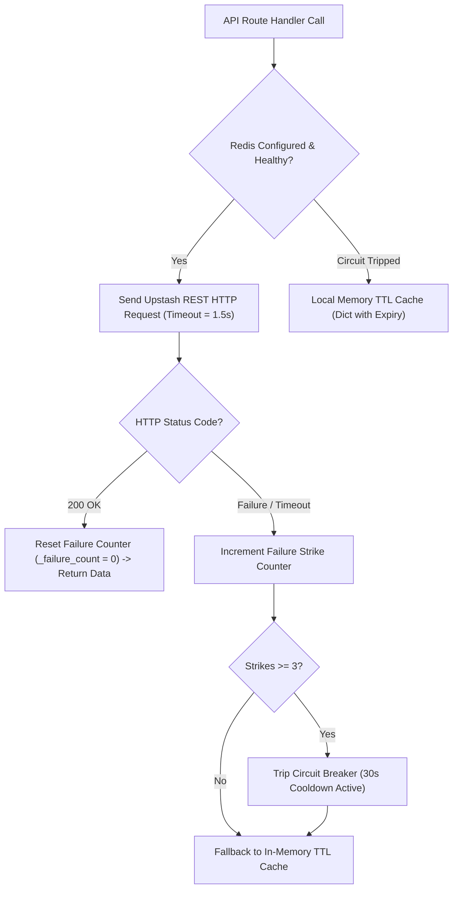
```mermaid
graph TD
    IncomingCall["API Route Handler Call"] --> CheckRedis{"Redis Configured & Healthy?"}
    
    CheckRedis -->|Yes| UpstashREST["Send Upstash REST HTTP Request (Timeout = 1.5s)"]
    CheckRedis -->|Circuit Tripped| LocalMemoryStore["Local Memory TTL Cache (Dict with Expiry)"]

    UpstashREST --> StatusCheck{"HTTP Status Code?"}
    StatusCheck -->|200 OK| SuccessReset["Reset Failure Counter (_failure_count = 0) -> Return Data"]
    StatusCheck -->|Failure / Timeout| IncrStrike["Increment Failure Strike Counter"]

    IncrStrike --> StrikeCheck{"Strikes >= 3?"}
    StrikeCheck -->|Yes| TripCircuit["Trip Circuit Breaker (30s Cooldown Active)"]
    StrikeCheck -->|No| FallbackToMem["Fallback to In-Memory TTL Cache"]
    TripCircuit --> FallbackToMem
```

### Rate Limiting Sliding Window Algorithm:
$$\text{Count}_{\text{current}} = \text{Requests}_{\text{current\_window}} + \text{Requests}_{\text{previous\_window}} \times \left(1 - \frac{t - t_{\text{window\_start}}}{\text{WindowSize}}\right)$$
Enforces a sliding limit (e.g., 60 requests/minute per IP/User) to prevent quota starvation.

---

## 6. Cognitive AI Reasoning Pipeline & Research Auditor Engine

The **Research Auditor** (`backend/routers/ai.py`, `backend/services/ai_service.py`) operates as an autonomous systematic review agent.

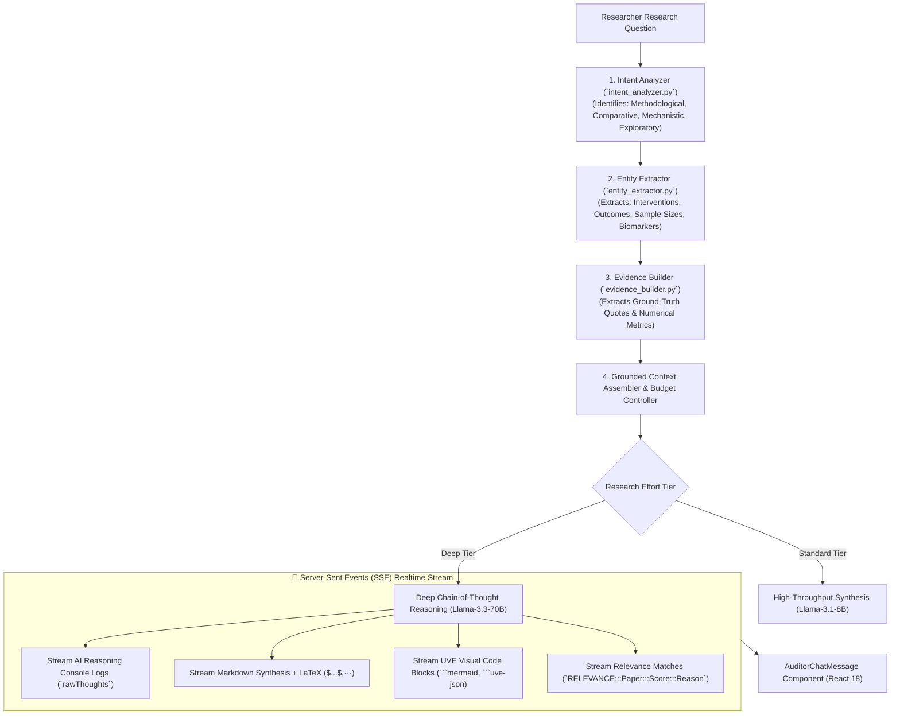
```mermaid
graph TD
    UserPrompt["Researcher Research Question"] --> IntentAnalysis["1. Intent Analyzer (`intent_analyzer.py`)<br/>(Identifies: Methodological, Comparative, Mechanistic, Exploratory)"]
    
    IntentAnalysis --> EntityExtraction["2. Entity Extractor (`entity_extractor.py`)<br/>(Extracts: Interventions, Outcomes, Sample Sizes, Biomarkers)"]
    
    EntityExtraction --> EvidenceBuilder["3. Evidence Builder (`evidence_builder.py`)<br/>(Extracts Ground-Truth Quotes & Numerical Metrics)"]
    
    EvidenceBuilder --> ContextAssembly["4. Grounded Context Assembler & Budget Controller"]
    
    ContextAssembly --> TierRouter{"Research Effort Tier"}

    TierRouter -->|Standard Tier| StandardInference["High-Throughput Synthesis (Llama-3.1-8B)"]
    TierRouter -->|Deep Tier| DeepCoTInference["Deep Chain-of-Thought Reasoning (Llama-3.3-70B)"]

    subgraph SSEStream ["📡 Server-Sent Events (SSE) Realtime Stream"]
        DeepCoTInference --> StreamReasoning["Stream AI Reasoning Console Logs (`rawThoughts`)"]
        DeepCoTInference --> StreamSynthesis["Stream Markdown Synthesis + LaTeX ($...$, $$...$$)"]
        DeepCoTInference --> StreamUVE["Stream UVE Visual Code Blocks (```mermaid, ```uve-json)"]
        DeepCoTInference --> StreamRelMeter["Stream Relevance Matches (`RELEVANCE:::Paper:::Score:::Reason`)"]
    end

    SSEStream --> ClientUI["AuditorChatMessage Component (React 18)"]
```

---

## 7. Universal Visualization Engine (UVE) Multi-Engine Dispatcher

The Universal Visualization Engine (`frontend/src/components/uve/`) parses structured visual blocks emitted by the AI engine.

```mermaid
graph TD
    AIStream["Incoming Visual Code Block"] --> UVEParser["VisualDispatcher Parser & JSON Auto-Repair"]
    
    UVEParser --> EngineSwitch{"Engine Selector"}

    EngineSwitch -->|mermaid / flowchart| MermaidEngine["MermaidAdapter (`MermaidDiagram.jsx`)<br/>- PRISMA Review Flowcharts<br/>- Protocol Sequences & Gantt<br/>- Subgraphs & Layout Clustering"]
    
    EngineSwitch -->|echarts / chart / bar / line| EChartsEngine["EChartsAdapter (`EChartsAdapter.jsx`)<br/>- Publication Year Trajectories<br/>- Sample Sizes (N) & Effect Sizes<br/>- Interactive Tooltips & SVG Export"]
    
    EngineSwitch -->|react-flow / mindmap| ReactFlowEngine["ReactFlowAdapter (`ReactFlowAdapter.jsx`)<br/>- Draggable Concept Ontologies<br/>- Interactive Force-Directed Physics<br/>- Hierarchical Knowledge Graphs"]
    
    EngineSwitch -->|d3 / network / graph| D3Engine["D3Adapter (`D3Adapter.jsx`)<br/>- Co-Authorship Topological Networks<br/>- Citation Density Graphs"]
    
    EngineSwitch -->|markdown / table| TableEngine["MarkdownAdapter (`MarkdownAdapter.jsx`)<br/>- High-Density Comparison Matrices<br/>- 1-Click XLSX Excel Export"]

    subgraph FrameShell ["🖼️ ArtifactFrame Wrapper (`VisualExpandModal.jsx`)"]
        MermaidEngine --> FrameShell
        EChartsEngine --> FrameShell
        ReactFlowEngine --> FrameShell
        D3Engine --> FrameShell
        TableEngine --> FrameShell
    end
```

---

## 8. Multimodal Vision RAG & Document Ingestion System

The **Vision RAG** pipeline (`backend/routers/attachments.py`, `backend/services/vision_service.py`) handles researcher-uploaded files.

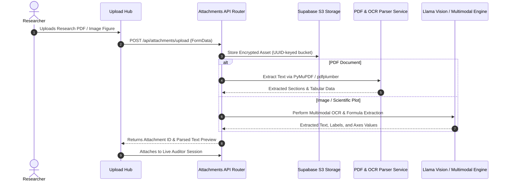
```mermaid
sequenceDiagram
    autonumber
    actor User as Researcher
    participant Frontend as Upload Hub
    participant AttachmentsRouter as Attachments API Router
    participant S3Storage as Supabase S3 Storage
    participant PDFParser as PDF & OCR Parser Service
    participant VisionLLM as Llama Vision / Multimodal Engine

    User->>Frontend: Uploads Research PDF / Image Figure
    Frontend->>AttachmentsRouter: POST /api/attachments/upload (FormData)
    AttachmentsRouter->>S3Storage: Store Encrypted Asset (UUID-keyed bucket)
    alt PDF Document
        AttachmentsRouter->>PDFParser: Extract Text via PyMuPDF / pdfplumber
        PDFParser-->>AttachmentsRouter: Extracted Sections & Tabular Data
    else Image / Scientific Plot
        AttachmentsRouter->>VisionLLM: Perform Multimodal OCR & Formula Extraction
        VisionLLM-->>AttachmentsRouter: Extracted Text, Labels, and Axes Values
    end
    AttachmentsRouter-->>Frontend: Returns Attachment ID & Parsed Text Preview
    Frontend->>AttachmentsRouter: Attaches to Live Auditor Session
```

---

## 9. Continuous Intelligence Hubs (Academy, Opportunities, News)

ScholarHub provides real-time academic intelligence across multiple dedicated portals:

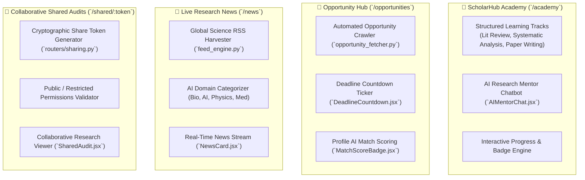
```mermaid
graph TD
    subgraph AcademyModule ["📘 ScholarHub Academy (`/academy`)"]
        Modules["Structured Learning Tracks<br/>(Lit Review, Systematic Analysis, Paper Writing)"]
        AIMentor["AI Research Mentor Chatbot (`AIMentorChat.jsx`)"]
        TrackProgress["Interactive Progress & Badge Engine"]
    end

    subgraph OpportunityModule ["💼 Opportunity Hub (`/opportunities`)"]
        Crawler["Automated Opportunity Crawler (`opportunity_fetcher.py`)"]
        Countdown["Deadline Countdown Ticker (`DeadlineCountdown.jsx`)"]
        MatchScore["Profile AI Match Scoring (`MatchScoreBadge.jsx`)"]
    end

    subgraph NewsModule ["📰 Live Research News (`/news`)"]
        FeedHarvester["Global Science RSS Harvester (`feed_engine.py`)"]
        CategorySort["AI Domain Categorizer (Bio, AI, Physics, Med)"]
        CardFeed["Real-Time News Stream (`NewsCard.jsx`)"]
    end

    subgraph SharedAuditModule ["🔗 Collaborative Shared Audits (`/shared/:token`)"]
        TokenGen["Cryptographic Share Token Generator (`routers/sharing.py`)"]
        AccessGuard["Public / Restricted Permissions Validator"]
        DeepLink["Collaborative Research Viewer (`SharedAudit.jsx`)"]
    end
```

---

## 10. Admin Control Plane, Telemetry & Realtime WebSockets

The **Admin Dashboard** (`frontend/src/pages/AdminPanel.jsx`, `backend/routers/admin.py`) provides real-time infrastructure observability.

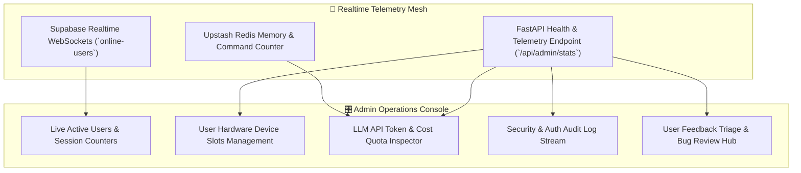
```mermaid
graph TD
    subgraph RealtimeTelemetry ["📡 Realtime Telemetry Mesh"]
        PresenceWS["Supabase Realtime WebSockets (`online-users`)"]
        FastAPIMonitor["FastAPI Health & Telemetry Endpoint (`/api/admin/stats`)"]
        UpstashRESTStats["Upstash Redis Memory & Command Counter"]
    end

    subgraph AdminDashboardUI ["🎛️ Admin Operations Console"]
        UserMetricCards["Live Active Users & Session Counters"]
        DeviceManager["User Hardware Device Slots Management"]
        QuotaInspector["LLM API Token & Cost Quota Inspector"]
        AuditLogViewer["Security & Auth Audit Log Stream"]
        FeedbackTriage["User Feedback Triage & Bug Review Hub"]
    end

    PresenceWS --> UserMetricCards
    FastAPIMonitor --> DeviceManager
    FastAPIMonitor --> QuotaInspector
    FastAPIMonitor --> AuditLogViewer
    FastAPIMonitor --> FeedbackTriage
    UpstashRESTStats --> QuotaInspector
```

---

## 11. Hardware-Enforced 2-Device Policy & Zero-Trust Security

To safeguard institutional subscriptions, ScholarHub enforces a strict **2-Device Active Limit**.

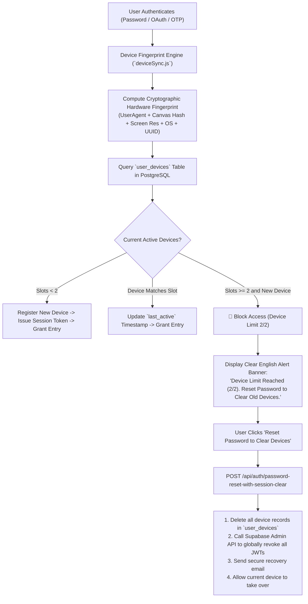
```mermaid
graph TD
    LoginReq["User Authenticates (Password / OAuth / OTP)"] --> DeviceSync["Device Fingerprint Engine (`deviceSync.js`)"]
    
    DeviceSync --> Fingerprint["Compute Cryptographic Hardware Fingerprint<br/>(UserAgent + Canvas Hash + Screen Res + OS + UUID)"]
    
    Fingerprint --> FetchSlots["Query `user_devices` Table in PostgreSQL"]
    
    FetchSlots --> SlotCheck{"Current Active Devices?"}

    SlotCheck -->|Slots < 2| RegisterSlot["Register New Device -> Issue Session Token -> Grant Entry"]
    SlotCheck -->|Device Matches Slot| UpdateSlot["Update `last_active` Timestamp -> Grant Entry"]
    SlotCheck -->|Slots >= 2 and New Device| BlockDevice["🛑 Block Access (Device Limit 2/2)"]

    BlockDevice --> BannerUX["Display Clear English Alert Banner:<br/>'Device Limit Reached (2/2). Reset Password to Clear Old Devices.'"]
    
    BannerUX --> ResetAction["User Clicks 'Reset Password to Clear Devices'"]
    
    ResetAction --> ResetAPI["POST /api/auth/password-reset-with-session-clear"]
    
    ResetAPI --> WipingPipeline["1. Delete all device records in `user_devices`<br/>2. Call Supabase Admin API to globally revoke all JWTs<br/>3. Send secure recovery email<br/>4. Allow current device to take over"]
```

---

## 12. Comprehensive Database Schema, DDL & Entity-Relationship Model

All tables reside in **Supabase PostgreSQL 15** with Row-Level Security (RLS) policies.

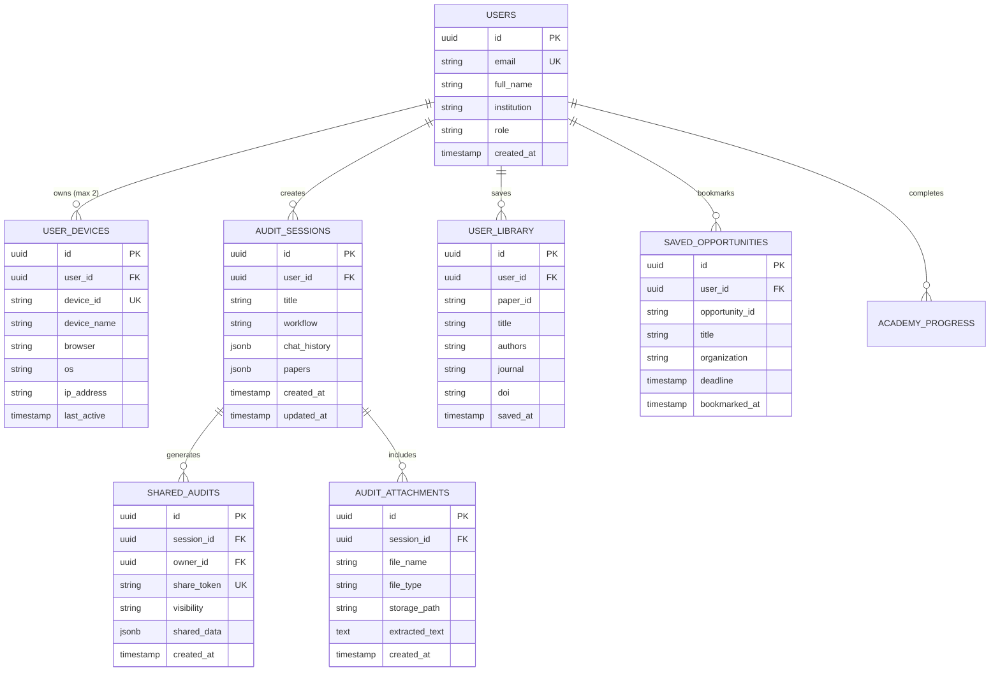
```mermaid
erDiagram
    USERS ||--o{ USER_DEVICES : "owns (max 2)"
    USERS ||--o{ AUDIT_SESSIONS : "creates"
    USERS ||--o{ USER_LIBRARY : "saves"
    USERS ||--o{ SAVED_OPPORTUNITIES : "bookmarks"
    USERS ||--o{ ACADEMY_PROGRESS : "completes"
    AUDIT_SESSIONS ||--o{ SHARED_AUDITS : "generates"
    AUDIT_SESSIONS ||--o{ AUDIT_ATTACHMENTS : "includes"

    USERS {
        uuid id PK
        string email UK
        string full_name
        string institution
        string role
        timestamp created_at
    }

    USER_DEVICES {
        uuid id PK
        uuid user_id FK
        string device_id UK
        string device_name
        string browser
        string os
        string ip_address
        timestamp last_active
    }

    AUDIT_SESSIONS {
        uuid id PK
        uuid user_id FK
        string title
        string workflow
        jsonb chat_history
        jsonb papers
        timestamp created_at
        timestamp updated_at
    }

    SHARED_AUDITS {
        uuid id PK
        uuid session_id FK
        uuid owner_id FK
        string share_token UK
        string visibility
        jsonb shared_data
        timestamp created_at
    }

    USER_LIBRARY {
        uuid id PK
        uuid user_id FK
        string paper_id
        string title
        string authors
        string journal
        string doi
        timestamp saved_at
    }

    SAVED_OPPORTUNITIES {
        uuid id PK
        uuid user_id FK
        string opportunity_id
        string title
        string organization
        timestamp deadline
        timestamp bookmarked_at
    }

    AUDIT_ATTACHMENTS {
        uuid id PK
        uuid session_id FK
        string file_name
        string file_type
        string storage_path
        text extracted_text
        timestamp created_at
    }
```

---

## 13. Frontend State Management & Zero-Jitter Render Pipeline

To eliminate UI shaking and layout instability during high-speed AI token streaming, ScholarHub uses an isolated memoization architecture in `Auditor.jsx`.

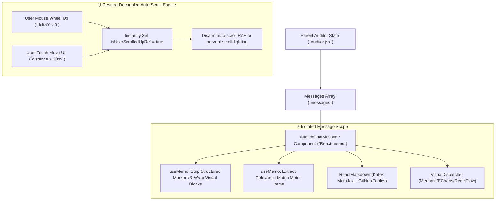
```mermaid
graph TD
    ParentView["Parent Auditor State (`Auditor.jsx`)"] --> MsgCollection["Messages Array (`messages`)"]
    
    MsgCollection --> MemoizedItem["AuditorChatMessage Component (`React.memo`)"]

    subgraph MessageItemScope ["⚡ Isolated Message Scope"]
        MemoizedItem --> UseMemoRegex["useMemo: Strip Structured Markers & Wrap Visual Blocks"]
        MemoizedItem --> UseMemoRelevance["useMemo: Extract Relevance Match Meter Items"]
        MemoizedItem --> ReactMarkdownRender["ReactMarkdown (Katex MathJax + GitHub Tables)"]
        MemoizedItem --> VisualDispatcherMount["VisualDispatcher (Mermaid/ECharts/ReactFlow)"]
    end

    subgraph GestureControl ["🖱️ Gesture-Decoupled Auto-Scroll Engine"]
        WheelEvent["User Mouse Wheel Up (`deltaY < 0`)"] --> DetachScrollLock["Instantly Set isUserScrolledUpRef = true"]
        TouchMoveEvent["User Touch Move Up (`distance > 30px`)"] --> DetachScrollLock
        DetachScrollLock --> DisarmScroll["Disarm auto-scroll RAF to prevent scroll-fighting"]
    end
```

---

## 14. Academic Recognition & Leadership Commendations

ScholarHub AI has been evaluated and commended by senior academic leadership:

> **"The platform looks very promising... I am truly happy to see your progress and would like to congratulate you on this impressive achievement. Your dedication and innovation are clearly reflected in the platform."**  
> — **Prof. Dr. Ahmed Wasif Reza**  
> *Dean, Faculty of Sciences and Engineering, East West University*

---

*Verified against production codebase v2.4.*  
*Maintained by the ScholarHub Core Engineering Team.*
