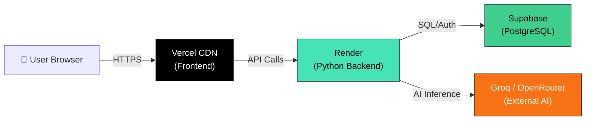
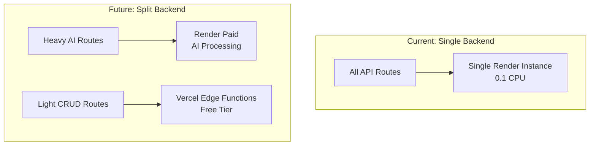

# 🏗️ ScholarHub AI — Infrastructure Scalability Analysis

> **Stack:** Vercel (Free) → Render (Free) → Supabase (Free)  
> **Date:** June 2026

---

## 1. Architecture Evaluation



### ✅ What Works Well

| Aspect | Rating | Details |
|---|---|---|
| **Frontend Delivery** | ⭐⭐⭐⭐⭐ | Vercel's global CDN ensures sub-100ms TTFB for static assets worldwide. React SPA is cached at the edge. |
| **Separation of Concerns** | ⭐⭐⭐⭐ | Clean 3-tier architecture: presentation (Vercel) → logic (Render) → data (Supabase). Each layer can be swapped independently. |
| **Database** | ⭐⭐⭐⭐ | Supabase provides managed PostgreSQL with built-in Auth, RLS, and real-time — far more capable than a typical hobby DB. |
| **Cost** | ⭐⭐⭐⭐⭐ | Total monthly cost: **$0.00**. Hard to beat. |

### ⚠️ Critical Bottlenecks

| Bottleneck | Severity | Explanation |
|---|---|---|
| **Render Cold Start** | 🔴 CRITICAL | After 15 min of inactivity, Render spins down. The **next request takes 30–60 seconds** to wake up. For a chatbot or research tool, this is a terrible first impression. |
| **Render Compute** | 🟠 HIGH | Only **0.1 CPU + 512 MB RAM**. A Python/FastAPI app with multiple AI calls can easily max this out under just 3–5 simultaneous requests. |
| **Supabase Inactivity Pause** | 🟡 MEDIUM | Free projects pause after **1 week of no activity**. If your DB pauses, the entire backend breaks until you manually unpause it. |
| **Cross-Region Latency** | 🟡 MEDIUM | Vercel serves globally, but if Render and Supabase are in different regions (e.g., Render in Oregon, Supabase in US-East), every API call adds 20–50ms of inter-region latency. |

---

## 2. Concurrent User Estimation

### The Math

The weakest link in your chain is **Render's free tier** (0.1 CPU, 512 MB RAM). Here's a realistic breakdown:

```
Per API Request (AI Chat):
├── FastAPI processing:           ~50ms CPU
├── Groq AI inference (external): ~500-2000ms (network wait, not CPU)  
├── Supabase DB query:            ~20-50ms
└── Total wall time:              ~600-2100ms per request
    CPU time consumed:            ~70-100ms per request
```

| Metric | Estimate | Reasoning |
|---|---|---|
| **Comfortable Concurrent Users** | **3–5** | With 0.1 CPU, you get ~100ms of CPU time per second. A single AI chat request uses ~80ms of CPU. So you can handle roughly 1 request/sec comfortably. |
| **Peak Concurrent (Before Errors)** | **8–12** | Python's async (FastAPI + `aiohttp`) allows concurrent I/O waits, so while 5 users are waiting for Groq to respond, 2–3 more can queue. Beyond this, you'll see 502/503 errors. |
| **Monthly Active Users (MAU)** | **200–500** | Assuming average user makes 5–10 requests per visit, visits 2–3 times/month. This stays well within Vercel's 1M function calls and Supabase's 10GB egress. |
| **Daily Active Users (DAU)** | **15–30** | Spread across time zones, this keeps concurrent load manageable. |

> [!WARNING]
> These numbers assume **users don't all arrive at once**. A single social media post going viral could bring 50+ simultaneous users and crash Render instantly.

### The Cold Start Tax

```
Timeline of a "Cold" User Experience:

0s ─── User opens site (Vercel: instant ✅)
0.1s ── Frontend loads beautifully
0.5s ── User clicks "Chat with Emo"  
0.5s ── Frontend sends API request to Render...
       ⏳ Render is asleep...
       ⏳ Waking up Python environment...
       ⏳ Loading FastAPI + dependencies...
30-60s ─ Render finally responds! 
         User has already left. ❌
```

---

## 3. Free Tier Hard Limits — Complete Breakdown

### Vercel (Frontend) — Hobby Plan

| Resource | Limit | Impact When Exceeded |
|---|---|---|
| Bandwidth | **100 GB/month** | Site goes **completely offline** until next month |
| Function Invocations | **1,000,000/month** | API routes stop working |
| Active CPU Time | **4 CPU-hours/month** | Serverless functions fail |
| Memory | **360 GB-hours/month** | Functions killed mid-execution |
| Build Time | **6,000 min/month** | Cannot deploy new updates |
| Commercial Use | ❌ **Not Allowed** | Vercel can suspend your account |

> [!CAUTION]
> If ScholarHub AI ever charges users (you have paid tiers at 250 BDT / 1000 BDT), **the Vercel Hobby plan violates their ToS**. You'd need the Pro plan ($20/mo).

### Render (Backend) — Free Tier

| Resource | Limit | Impact When Exceeded |
|---|---|---|
| CPU | **0.1 vCPU** | Requests queue up → 502 errors |
| RAM | **512 MB** | App crashes with OOM (Out of Memory) |
| Spin Down | **15 min idle** | 30–60s cold start for next user |
| Outbound Bandwidth | **100 GB/month** | Service suspended |
| Free DB Storage | **1 GB** (if using Render DB) | Write operations blocked |
| Free DB Lifetime | **30 days** | Database auto-deleted! |
| Autoscaling | ❌ **None** | Cannot add more instances |

### Supabase (Database) — Free Tier

| Resource | Limit | Impact When Exceeded |
|---|---|---|
| Database Size | **500 MB** | Write operations rejected |
| Egress (Bandwidth) | **10 GB/month** | Queries start failing |
| File Storage | **1 GB** | Upload blocked |
| Active Projects | **2 max** | Cannot create new projects |
| Auth MAU | **50,000** | New signups blocked |
| Realtime Connections | **200 concurrent** | WebSocket connections refused |
| Realtime Messages | **2M/month** | Realtime updates stop |
| Edge Functions | **500,000/month** | Edge functions fail |
| Inactivity Pause | **1 week** | Entire database goes offline |
| Backups | **7-day snapshots only** | No point-in-time recovery |

---

## 4. Scalability & Upgrade Path

### Is This Setup Scalable?

| Scaling Type | Possible? | Details |
|---|---|---|
| **Horizontal (add more instances)** | ✅ Vercel, ❌ Render Free | Vercel auto-scales. Render Free = 1 instance only. |
| **Vertical (bigger machine)** | ❌ Free Tiers | All three platforms require paid plans to upgrade compute. |
| **Database Scaling** | ❌ Free Tier | Supabase Free = shared compute, fixed 500MB. |

### 💰 Cost-Effective Upgrade Roadmap

#### Phase 1: Fix the Cold Start (Cost: $7/mo)

> [!IMPORTANT]
> This single change has the **highest ROI** of any upgrade you can make.

```diff
- Render Free Tier ($0/mo)
    → 0.1 CPU, 512 MB RAM, spins down after 15 min
    
+ Render Starter ($7/mo)
    → 0.5 CPU, 512 MB RAM, ALWAYS ON (no cold starts!)
    → Can handle ~15-25 concurrent users
```

**Result:** Eliminates the 30–60s cold start problem entirely. Your chatbot responds in 1–2 seconds instead of 60.

#### Phase 2: Scale the Database (Cost: $25/mo)

```diff
- Supabase Free ($0/mo)
    → 500 MB DB, 10 GB egress, pauses after 1 week
    
+ Supabase Pro ($25/mo)
    → 8 GB DB, 250 GB egress, NEVER pauses
    → Daily backups + Point-in-time recovery
    → Dedicated compute
```

**Result:** Database never sleeps, 16x more storage, 25x more bandwidth.

#### Phase 3: Go Commercial (Cost: $20/mo)

```diff
- Vercel Hobby ($0/mo)
    → 100 GB bandwidth, non-commercial only
    
+ Vercel Pro ($20/mo)
    → 1 TB bandwidth, commercial use allowed ✅
    → Team features, preview deployments
```

**Result:** Legally allowed to charge users. 10x more bandwidth.

#### Full Upgrade Summary

| Phase | Monthly Cost | Concurrent Users | MAU Capacity |
|---|---|---|---|
| **Current (All Free)** | $0 | 3–5 | 200–500 |
| **Phase 1 (Render Starter)** | $7 | 15–25 | 1,000–2,000 |
| **Phase 1+2 (+ Supabase Pro)** | $32 | 25–40 | 3,000–5,000 |
| **Phase 1+2+3 (+ Vercel Pro)** | $52 | 40–60 | 5,000–10,000 |
| **Future (Render Pro + Supabase Pro)** | $100+ | 100+ | 20,000+ |

---

## 5. Immediate Action Items

### Quick Wins (Free)

- [ ] **Use UptimeRobot** — Set up a free monitor to ping your Render backend every 5 minutes. This prevents cold starts by keeping the service warm.
- [ ] **Co-locate Regions** — Ensure Render and Supabase are in the **same region** (e.g., both in `us-east-1`) to minimize inter-service latency.
- [ ] **Add Connection Pooling** — Use Supabase's built-in PgBouncer (port `6543`) instead of direct connections to prevent connection exhaustion.
- [ ] **Enable Supabase Caching** — Use response caching headers on frequent API calls to stay under the 10 GB egress limit.

### Architecture Tip



Move lightweight CRUD operations (user profile, settings, library) to **Vercel API Routes / Edge Functions** (free). Keep only heavy AI inference on Render. This distributes load and reduces Render pressure.

---

> [!TIP]
> **Bottom Line:** Your current $0/month stack is perfectly fine for a hobby/portfolio project with < 500 monthly users. The moment you're ready to accept real users or charge money, the **first $7/month upgrade (Render Starter)** will have the single biggest impact on user experience by eliminating cold starts.
